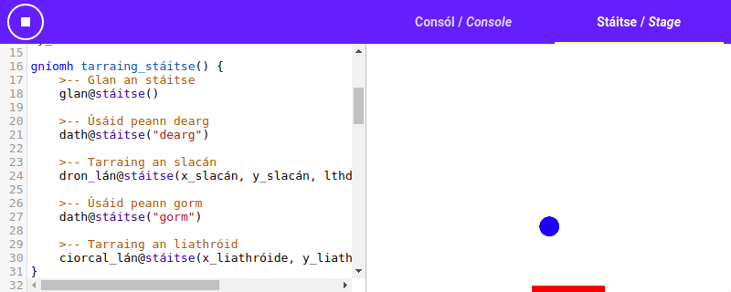
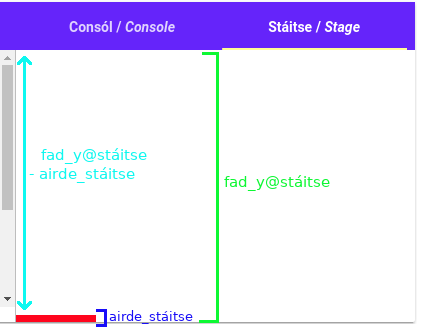
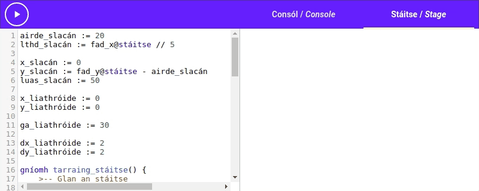
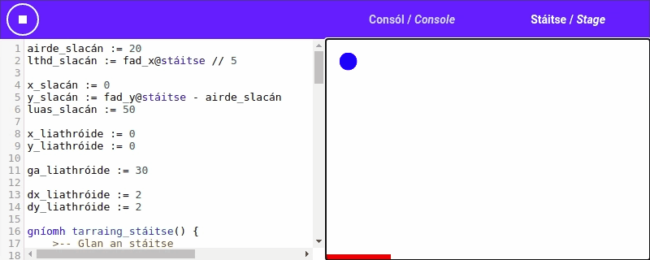

# [[Cluiche Preibe|Bounce game]]

Anois bainimis úsáid as ár n-eolas nua agus roinnt gníomhartha nua chun cluiche a chruthú cosúil
leis na cluichí cáiliúla *Pong* nó *Breakout*. Beidh [[slacán|paddle]] againn ag bun an stáitse agus
beidh muid ábalta é a bhogadh chun [[bhreith|catch]] ar an [[liathróid|ball]]
[[ag preabadh|bouncing]].



# An [[Lúb Tarraingthe|Draw loop]]

Chun ár [[ngrafaicí|graphics]] a [[smachtú|control]] bainfimid úsáid as "lúb tarraingthe". Is
[[coincheap|concept]] simplí é lúb tarraingthe: Cruthóimid gníomh chun na páirteanna dár gcluiche a
tharraingt ar an stáitse agus glaofaimid air arís agus arís i lúb, ní stopfaimid go dtí go stopann
an cluiche.

Tar éis gach glaoch ar an gníomh, ba chóir dúinn fanacht ar feadh cúpla milleasoicind chun
[[caochaíl|jitter]] a [[sheachaint|prevent]].

Tosaímis leis an cód seo:

```{.setanta .numberLines}
gníomh tarraing_stáitse() {
    >-- Cuirfimid ár cód tarraingthe anseo.
}

>-- Lúb go deo.
nuair-a fíor {
    >-- Glaoigh ar an gníomh tarraing_stáitse.
    tarraing_stáitse()

    >-- Codail ar feadh cúple milleasoicind.
    codladh(10)
}
```

# An Slacán

Tosaímis anois leis an slacán. Teastaíonn slacán uainn ar féidir linn bogadh ar [[chlé|left]] agus
ar [[dheis|right]] ag bun an stáitse. Cruthaímis roinnt athróga agus cuirimis cód sa ghníomh
`tarraing_stáitse`{.setanta} chun an slacán a tharraingt.

Cruthaímis athróga `airde_slacáin` agus `lthd_slacáin` le haghaidh [[airde|height]] agus
[[leithead|width]] an slacáin. Le haghaidh an airde, is féidir linn luach beag (m.sh.
`20`{.setanta}) chun slacán beag ach [[infheicthe|visible]] a fháil. Le haghaidh an leithead is
féidir linn `fad_x@stáitse`{.setanta} a úsáid chun leithead a roghnú ata cothrom le 20% de leithead
an stáitse.

Anois cuirimid an cód seo sa ríomhchlár:

```{.setanta .numberLines}
airde_slacáin := 20
lthd_slacáin := fad_x@stáitse // 5
```

Anois is féidir linn 2 athróg nua `x_slacáin` agus `y_slacáin` a dhéanamh. Cuirfimid an x-
[[comhordanáid|coordinate]] agus an y-comhordanáid sna hathróga sin. [[Go sonrach|Specifically]],
cuirimid comhordanáidí an [[cúinne ag an mbarr ar dheis|top right corner]] den slacán sna hathróga
sin. Ba mhaith linn tosaigh leis an slacán ag bun an stáitse ar an taobh clé, dá bhrí sin tosóimid
le `x_slacáin` cothrom le `0`{.setanta}, ach cad a úsáidfimid le haghaidh `y_slacáin`? Má úsáidimid
`0`{.setanta} beidh an slacán ag barr an stáitse, ach má úsáidfimid `fad_y@stáitse`{.setanta} ní
bheimid in ann an slacán a fheiceáil mar beidh sé faoi bhun an stáitse. Caithfimid airde an slacáin
a [[bhaint as|subtract from]] airde an stáitse chun an y-comhordanáid ceart a fháil: `fad_y@stáitse
- airde_slacáin`{.setanta}.



Anois seo é ár ríomhchlár [[reatha|current]].

```{.setanta .numberLines}
airde_slacáin := 20
lthd_slacáin := fad_x@stáitse // 5

x_slacáin := 0
y_slacáin := fad_y@stáitse - airde_slacáin

gníomh tarraing_stáitse() {
    >-- Cuirfimid ár cód tarraingthe anseo.
}

>-- Lúb go deo.
nuair-a fíor {
    >-- Glaoigh ar an gníomh tarraing_stáitse.
    tarraing_stáitse()

    >-- Codail ar feadh cúple milleasoicind.
    codladh(10)
}
```

## Tarraing an slacán

Anois tá a fhios againn cá bhfuil ár slacán (`x_slacáin`, `y_slacáin`) agus
[[cé chomh mór atá sé|how big it is]] (`airde_slacáin`, `lthd_slacáin`), is féidir linn é a
tharraingt.

Sula dtarraingeoimid ár slacán, ba chóir dúinn an stáitse a ghlanadh chun aon
[[sean-rudaí|old things]] a [[scriosadh|erase]]. Bainimid úsáid as an gníomh
`glan@stáitse`{.setanta} chun é sin a dhéanamh.

Tar éis é sin, is féidir linn [[dath an pinn|colour of the pen]] a athrú. Ba mhaith liom slacán
dearg a tharraingt, mar sin athróidh mé an dath go dearg le `dath@stáitse("dearg")`{.setanta}.

Anois táimid in ann an gníomh `dron_lán@stáitse`{.setanta} a úsáid chun
[[**dron**uilleog **lán**|full rectangle]] a tharraingt le haghaidh an slacán. Glacann sé le 4
argóint: an x-comhordanáid, an y-comhordanáid, an leithead agus an airde:

Anois seo é ár gníomh `tarraing_stáitse`:

```{.setanta .numberLines}
gníomh tarraing_stáitse() {
    >-- Glan an stáitse
    glan@stáitse()

    >-- Úsáid peann dearg
    dath@stáitse("dearg")

    >-- Tarraing an slacán
    dron_lán@stáitse(x_slacáin, y_slacáin, lthd_slacáin, airde_slacáin)
}
```

Anois bainimis triail as ár ríomhchlár:

{{{s
airde_slacáin := 20
lthd_slacáin := fad_x@stáitse // 5

x_slacáin := 0
y_slacáin := fad_y@stáitse - airde_slacáin

gníomh tarraing_stáitse() {
    >-- Glan an stáitse
    glan@stáitse()

    >-- Úsáid peann dearg
    dath@stáitse("dearg")

    >-- Tarraing an slacán
    dron_lán@stáitse(x_slacáin, y_slacáin, lthd_slacáin, airde_slacáin)
}

>-- Lúb go deo.
nuair-a fíor {
    >-- Glaoigh ar an gníomh tarraing_stáitse.
    tarraing_stáitse()

    >-- Codail ar feadh cúple milleasoicind.
    codladh(10)
}
}}}

**Ná dean dearmad an [[cnaipe|button]] <iron-icon class="play" icon="av:stop"></iron-icon> a bhrúigh
chun an ríomhchlár a stopadh**

Bá chóir duit slacán beag dearg ag bun an stáitse a fheiceáil.

## Bog an slacán

Anois is féidir linn an slacán a tharraingt ach conas a bhogaimid é? Is féidir linn an gníomh
[[`méarchlár`|keyboard]] a úsáid chun gach [[eochairbhrú|keypress]] a fháil ón
[[úsáideoir|user]].

Ar dtús, cruthaímis gníomh nua agus tugaimis `smacht_eochrach` air. Glaofar ar an gníomh seo nuair a
brúnn an úsáideoir [[eochair|key]] ar an méarchlár. Bá chóir dó glacadh le argóint amháin: an
eochair a bhí [[brúite|pressed]].

```{.setanta .numberLines}
gníomh smacht_eochrach(eochair) {
}
```

Anois cuirimis `scríobh(eochair)`{.setanta} sa ghníomh, ach athróimid é sin níos déanaí.

```{.setanta .numberLines}
gníomh smacht_eochrach(eochair) {
    scríobh(eochair)
}
```

Bainimid úsáid as an gníomh `méarchlár@stáitse`{.setanta} chun ár ngníomh nua a [[nasc|connect]]
leis an méarchlár. Glaoimid ar `méarchlár@stáitse(smacht_eochrach)`{.setanta} chun é sin a dhéanamh.

**Tosaigh an ríomhchlár nua anseo, brúigh ar na [[saigheadeochracha|arrow keys]] ar do mhéarchlár
agus ansin bog go dtí an consól agus féach air.**

{{{s
airde_slacáin := 20
lthd_slacáin := fad_x@stáitse // 5

x_slacáin := 0
y_slacáin := fad_y@stáitse - airde_slacáin

gníomh tarraing_stáitse() {
    >-- Glan an stáitse
    glan@stáitse()

    >-- Úsáid peann dearg
    dath@stáitse("dearg")

    >-- Tarraing an slacán
    dron_lán@stáitse(x_slacáin, y_slacáin, lthd_slacáin, airde_slacáin)
}

gníomh smacht_eochrach(eochair) {
    scríobh(eochair)
}

méarchlár@stáitse(smacht_eochrach)

>-- Lúb go deo.
nuair-a fíor {
    >-- Glaoigh ar an gníomh tarraing_stáitse.
    tarraing_stáitse()

    >-- Codail ar feadh cúple milleasoicind.
    codladh(10)
}
}}}

Ba chóir duit "ArrowRight", "ArrowLeft", "ArrowDown" nó "ArrowUp" a fheiceáil ar an gconsól. **Tá na
hainmneacha seo as Béarla mar is ainmneacha [[caighdeánacha|standard]] iad, tagann na hainmneacha ón
[[brabhsalaí|browser]], ní rudaí *Setanta* iad.** Nuair a bhrúnn tú ar eochair éigin agus an
ríomhchlár ar siúl, glaoitear ar `smacht_eochrach` le ainm na heochrach. Is féidir linn an
[[cumas|ability]] seo a úsáid chun an slacán a bhogadh nuair a bhrúitear ar an [[saighead|arrow]] chlé nó
dheis.

Cruthaímis anois athróg nua `luas_slacáin` chun luas an slacáin a smachtú (cé chomh fada a bhogann an
slacán nuair a bhrúnn an úsáideoir saighead éigin). Tosaímis leis an luach `50`{.setanta}.

Anois is féidir linn cód a chur inár ngníomh `smacht_eochrach` chun an athróg `x_slacáin` a athrú
chun an slacán a bhogadh ar dheis nó ar chlé mar seo:

```{.setanta .numberLines}
luas_slacáin := 50

gníomh smacht_eochrach(eochair) {
    má eochair == "ArrowLeft" {
        x_slacáin -= luas_slacáin
    } nó má eochair == "ArrowRight" {
        x_slacáin += luas_slacáin
    }
}
```

Oibríonn an cód mar seo: má brúitear an saighead chlé, glaoitear ar an ngníomh `smacht_eochrach`
leis an téacs "ArrowLeft"; Má tharlaíonn é sin, [[laghdaímid|we decrease]] an athróg `x_slacáin`
faoi `luas_slacáin`.  Ar an lámh eile, má brúitear an saighead dheis, glaoitear ar an gníomh le
"ArrowRight" agus [[méadaímid|we increase]] `x_slacáin` faoi `luas_slacáin`.

Bain triail as an cód nua: Brúigh ar ← nó → agus ba chóir duit a fheiceáil an slacán ag bogadh.

{{{s
airde_slacáin := 20
lthd_slacáin := fad_x@stáitse // 5

x_slacáin := 0
y_slacáin := fad_y@stáitse - airde_slacáin
luas_slacáin := 50

gníomh tarraing_stáitse() {
    >-- Glan an stáitse
    glan@stáitse()

    >-- Úsáid peann dearg
    dath@stáitse("dearg")

    >-- Tarraing an slacán
    dron_lán@stáitse(x_slacáin, y_slacáin, lthd_slacáin, airde_slacáin)
}

gníomh smacht_eochrach(eochair) {
    má eochair == "ArrowLeft" {
        x_slacáin -= luas_slacáin
    } nó má eochair == "ArrowRight" {
        x_slacáin += luas_slacáin
    }
}

méarchlár@stáitse(smacht_eochrach)

>-- Lúb go deo.
nuair-a fíor {
    >-- Glaoigh ar an gníomh tarraing_stáitse.
    tarraing_stáitse()

    >-- Codail ar feadh cúple milleasoicind.
    codladh(10)
}
}}}

# An Liathróid

Tá ár slacán againn, agus tá sé in am an liathróid a chruthú chun preab
[[timpeall an stáitse|around the stage]]. Díreach mar a rinneamar don slacán, déanaimis athróga
nua chun áit an liathróid a stóráil `x_liathróide` agus `y_liathróide`. Ba mhaith linn tosaigh leis
an liathróid sa chúinne ag barr ar chlé, dá bhrí sin tosaímis le `x_liathróide` agus `y_liathróide`
cothrom le `0`{.setanta}.

Anois cruthaímis athróg nua do gha na liathróide agus cuirimis `30`{.setanta} isteach.

Faoi dheireadh, tá 2 athróg uainn chun treo na liathróide a smachtú. Tugaimid `dx_liathróide` agus
`dy_liathróide` orthu. Is é an luas sa threo x é `dx_liathróide` agus is é an luas sa threo y
`dy_liathróide`. Tosaímis leis an dhá acu cothrom le `2`{.setanta}.

```{.setanta .numberLines}
x_liathróide := 0
y_liathróide := 0

ga_liathróide := 30

dx_liathróide := 2
dy_liathróide := 2
```

## Tarraing an Liathróid

Anois cuirimis an cód chun an liathróid a tharraingt leis ár ríomhchlár. Athróimid dath an pinn go
gorm agus bainfimid úsáid as an gníomh `ciorcal_lán`{.setanta} chun an liathróid a tharraingt.

```{.setanta .numberLines}
gníomh tarraing_stáitse() {
    >-- Glan an stáitse
    glan@stáitse()

    >-- Úsáid peann dearg
    dath@stáitse("dearg")

    >-- Tarraing an slacán
    dron_lán@stáitse(x_slacáin, y_slacáin, lthd_slacáin, airde_slacáin)

    >-- Úsáid peann gorm
    dath@stáitse("gorm")

    >-- Tarraing an liathróid
    ciorcal_lán@stáitse(x_liathróide, y_liathróide, ga_liathróide)
}
```

## Bog an Liathróid

Ba mhaith linn go bhogann an liathróid: Cruthaímis gníomh nua `bog_liathróid` agus glaoimis air inár
lúb tarraingthe. Sa ghníomh seo, ba chóir dúinn an liathróid a bhogadh, [[go háirithe|specifically]]
`dx_liathróide` sa treo x, agus `dy_liathróide` sa treo y.

```{.setanta .numberLines}
gníomh bog_liathróid() {
    x_liathróide += dx_liathróide
    y_liathróide += dy_liathróide
}

...

nuair-a fíor {
    >-- Glaoigh ar an gníomh tarraing_stáitse.
    tarraing_stáitse()

    >-- Bog an liathróid
    bog_liathróid()

    >-- Codail ar feadh cúple milleasoicind.
    codladh(10)
}
```

Rith an cód atá againn faoi láthair:

{{{s
airde_slacáin := 20
lthd_slacáin := fad_x@stáitse // 5

x_slacáin := 0
y_slacáin := fad_y@stáitse - airde_slacáin
luas_slacáin := 50

x_liathróide := 0
y_liathróide := 0

ga_liathróide := 30

dx_liathróide := 2
dy_liathróide := 2

gníomh tarraing_stáitse() {
    >-- Glan an stáitse
    glan@stáitse()

    >-- Úsáid peann dearg
    dath@stáitse("dearg")

    >-- Tarraing an slacán
    dron_lán@stáitse(x_slacáin, y_slacáin, lthd_slacáin, airde_slacáin)

    >-- Úsáid peann gorm
    dath@stáitse("gorm")

    >-- Tarraing an liathróid
    ciorcal_lán@stáitse(x_liathróide, y_liathróide, ga_liathróide)
}

gníomh bog_liathróid() {
    x_liathróide += dx_liathróide
    y_liathróide += dy_liathróide
}

gníomh smacht_eochrach(eochair) {
    má eochair == "ArrowLeft" {
        x_slacáin -= luas_slacáin
    } nó má eochair == "ArrowRight" {
        x_slacáin += luas_slacáin
    }
}

méarchlár@stáitse(smacht_eochrach)

>-- Lúb go deo.
nuair-a fíor {
    >-- Glaoigh ar an gníomh tarraing_stáitse.
    tarraing_stáitse()

    >-- Bog an liathróid
    bog_liathróid()

    >-- Codail ar feadh cúple milleasoicind.
    codladh(10)
}
}}}



[[A thiarcais!|Oh no!]] Téann an liathróid díreach tríd an slacán! Déanann sé sin mar ní scríobhamar
aon [[loighic|logic]] faoi cad a tharlaíonn nuair a bhuaileann an slacán agus an liathróid le
chéile, nó nuair a bhuaileann an liathróid [[imill na stáitse|edges of the stage]]. Déanaimis é sin
anois.

## Preab as na ballaí

Chun [[loighic preibe|bounce logic]] a chruthú, ba chóir dúinn ár gníomh `bog_liathróid` a athrú. Sa
ghníomh sin ba chóir dúinn seic a dhéanamh an bhfuil an liathróid ag dul thar ballaí an stáitse,
agus má tá sé ba chóir dúinn é a chasadh timpeall.

Mar shampla, má bheidh an x-comhordanáid níos lú ná `0`{.setanta}, beidh sé imithe thar an balla
chlé, dá bhrí sin ba chóir dúinn é a chasadh timpeall sa treo x. Mar an gcéanna má bheidh an
x-comhordanáid níos mó ná `fad_x@stáitse`{.setanta} ba chóir dúinn an liathróid a chasadh timpeall
agus má bheidh an y-comhordanáid níos lú ná `0`{.setanta} ba chóir dúinn an liathróid a chasadh
timpeall sa treo y.

Seo é ar gcód faoi láthair:

```{.setanta .numberLines}
gníomh bog_liathróid() {
    x_liathróide += dx_liathróide
    y_liathróide += dy_liathróide
}
```

Cruthaímis 2 athróg nua inár gníomh: `x_tuartha` agus `y_tuartha`. Bainfimid úsáid astu chun suíomh
na liathróide atá [[tuartha|predicted]] a stóráil, ansin b'fhéidir linn iad a úsáid chun seic a
dhéanamh an mbeidh an liathróid thar imill na stáitse. Seo é ár gcód nua, ní dhéanann sé aon rud
difriúil ach tá spás ann chun seiceanna a dhéanamh níos déanaí.

```{.setanta .numberLines}
gníomh bog_liathróid() {
    >-- Cá bhfuil an liathróid ag dul?
    x_tuartha := x_liathróide + dx_liathróide
    y_tuartha := y_liathróide + dy_liathróide

    >-- Déanfaimid ár seiceanna anseo

    >-- Tar éis na seiceanna, úasdátaigh áit na liathróide.
    x_liathróide += dx_liathróide
    y_liathróide += dy_liathróide
}
```

Anois tá sé in am tosú ag scríobh ár loighic preibe. Chun an liathróid a chasadh timpeall sa treo x,
níl le déanamh againn ach an luach `dx_liathróide` a athrú go [[diúltach|negative]]. Mar an gcéanna,
chun an liathróid a chasadh timpeall sa treo y, athraímid `dy_liathróide` go `-dy_liathróide`.

Má tá an liathróid ar tí dul thar bun an stáitse, tá an cluiche thart. Is féidir linn an gníomh
`stop()` a úsáid chun an ríomhchlár a stopadh.

Seo an cód chun é sin a dhéanamh:

```{.setanta .numberLines}
gníomh bog_liathróid() {
    >-- Cá bhfuil an liathróid ag dul?
    x_tuartha := x_liathróide + dx_liathróide
    y_tuartha := y_liathróide + dy_liathróide

    >-- Déanfaimid ár seiceanna anseo

    má x_tuartha < 0 {
        >-- Beidh an liathróid thar an taobh chlé.
        >-- Cas an liathróid timpeall sa treo x.
        dx_liathróide = -dx_liathróide
    }
    má x_tuartha > fad_x@stáitse {
        >-- Beidh an liathróid thar an taobh dheis.
        >-- Cas an liathróid timpeall sa treo x.
        dx_liathróide = -dx_liathróide
    }
    má y_tuartha < 0 {
        >-- Beidh an liathróid thar barr an stáitse.
        >-- Cas an liathróid timpeall sa treo y.
        dy_liathróide = -dy_liathróide
    }
    má y_tuartha > fad_y@stáitse {
        >-- Tá an liathróid ag dul thar bun an stáitse.
        >-- Tá an cluiche thart.
        scríobh("CLUICHE THART")
        stop()
    }

    >-- Tar éis na seiceanna, úasdátaigh áit na liathróide.
    x_liathróide += dx_liathróide
    y_liathróide += dy_liathróide
}
```

## Preab as an slacán

Anois preabann an liathróid as na ballaí, ach fós téann sé díreach tríd an slacán. Nuair a théann an
liathróid síos go dtí leibhéal an tslacáin, is féidir linn [[seic breise|extra check]] a dhéanamh an
bhfuil an slacán faoin liathróid, agus má tá sé casfaimid an liathróid timpeall díreach mar a
dhéanaimid nuair a bhuaileann sé imill an stáitse.

Chun seic a dhéanamh an bhfuil an slacán faoin liathróid, is féidir linn seiceáil an bhfuil lár an
liathróid (`x_tuartha`) idir `x_slacáin` agus `x_slacáin + lthd_slacáin`.

```{.setanta .numberLines}
gníomh bog_liathróid() {
    >-- Cá bhfuil an liathróid ag dul?
    x_tuartha := x_liathróide + dx_liathróide
    y_tuartha := y_liathróide + dy_liathróide

    >-- Déanfaimid ár seiceanna anseo

    má x_tuartha < 0 {
        >-- Beidh an liathróid thar an taobh chlé.
        >-- Cas an liathróid timpeall sa treo x.
        dx_liathróide = -dx_liathróide
    }
    má x_tuartha > fad_x@stáitse {
        >-- Beidh an liathróid thar an taobh dheis.
        >-- Cas an liathróid timpeall sa treo x.
        dx_liathróide = -dx_liathróide
    }
    má y_tuartha < 0 {
        >-- Beidh an liathróid thar barr an stáitse.
        >-- Cas an liathróid timpeall sa treo y.
        dy_liathróide = -dy_liathróide
    }
    má y_tuartha > fad_y@stáitse {
        >-- Tá an liathróid ag dul thar bun an stáitse.
        >-- Tá an cluiche thart.
        scríobh("CLUICHE THART")
        stop()
    }

    má y_tuartha > y_slacáin {
        >-- Tá an liathróid ag leibhéal an tslacáin.
        >-- Déan seic an bhfuil an slacán faoin liathróid?
        má x_slacáin <= x_tuartha & x_tuartha <= x_slacáin + lthd_slacáin {
            dy_liathróide = -dy_liathróide
        }
    }

    >-- Tar éis na seiceanna, úasdátaigh áit na liathróide.
    x_liathróide += dx_liathróide
    y_liathróide += dy_liathróide
}
```

Bain triail as!

{{{s
airde_slacáin := 20
lthd_slacáin := fad_x@stáitse // 5

x_slacáin := 0
y_slacáin := fad_y@stáitse - airde_slacáin
luas_slacáin := 50

x_liathróide := 0
y_liathróide := 0

ga_liathróide := 30

dx_liathróide := 2
dy_liathróide := 2

gníomh tarraing_stáitse() {
    >-- Glan an stáitse
    glan@stáitse()

    >-- Úsáid peann dearg
    dath@stáitse("dearg")

    >-- Tarraing an slacán
    dron_lán@stáitse(x_slacáin, y_slacáin, lthd_slacáin, airde_slacáin)

    >-- Úsáid peann gorm
    dath@stáitse("gorm")

    >-- Tarraing an liathróid
    ciorcal_lán@stáitse(x_liathróide, y_liathróide, ga_liathróide)
}

gníomh bog_liathróid() {
    >-- Cá bhfuil an liathróid ag dul?
    x_tuartha := x_liathróide + dx_liathróide
    y_tuartha := y_liathróide + dy_liathróide

    >-- Déanfaimid ár seiceanna anseo

    má x_tuartha < 0 {
        >-- Beidh an liathróid thar an taobh chlé.
        >-- Cas an liathróid timpeall sa treo x.
        dx_liathróide = -dx_liathróide
    }
    má x_tuartha > fad_x@stáitse {
        >-- Beidh an liathróid thar an taobh dheis.
        >-- Cas an liathróid timpeall sa treo x.
        dx_liathróide = -dx_liathróide
    }
    má y_tuartha < 0 {
        >-- Beidh an liathróid thar barr an stáitse.
        >-- Cas an liathróid timpeall sa treo y.
        dy_liathróide = -dy_liathróide
    }
    má y_tuartha > fad_y@stáitse {
        >-- Tá an liathróid ag dul thar bun an stáitse.
        >-- Tá an cluiche thart.
        scríobh("CLUICHE THART")
        stop()
    }

    má y_tuartha > y_slacáin {
        >-- Tá an liathróid ag leibhéal an tslacáin.
        >-- Déan seic an bhfuil an slacán faoin liathróid?
        má x_slacáin <= x_tuartha & x_tuartha <= x_slacáin + lthd_slacáin {
            dy_liathróide = -dy_liathróide
        }
    }

    >-- Tar éis na seiceanna, úasdátaigh áit na liathróide.
    x_liathróide += dx_liathróide
    y_liathróide += dy_liathróide
}

gníomh smacht_eochrach(eochair) {
    má eochair == "ArrowLeft" {
        x_slacáin -= luas_slacáin
    } nó má eochair == "ArrowRight" {
        x_slacáin += luas_slacáin
    }
}

méarchlár@stáitse(smacht_eochrach)

>-- Lúb go deo.
nuair-a fíor {
    >-- Glaoigh ar an gníomh tarraing_stáitse.
    tarraing_stáitse()

    >-- Bog an liathróid
    bog_liathróid()

    >-- Codail ar feadh cúple milleasoicind.
    codladh(10)
}
}}}



Oibríonn Sé! Preabann an liathróid as na ballaí agus an slacán, ach críochnaíonn an cluiche má
théann sé thar bun an stáitse.

# Dúshlán

Seo cúpla [[smaointe|ideas]] a d'fhéadaimis a úsáid chun ár gcluiche a [[fheabhsú|improve]]:

- Athraigh an ríomhchlár ionas go bhfuil scór ag [[an imreoir|the player]]. Méadaigh an scór gach
  uair a bhuaileann an liathróid leis an slacán, agus ag deireadh an chluiche scríobh an scór ar an
  gconsól.
- Cruthaigh [[córas saolta|lives system]]: tosaíonn an t-imreoir le méid saolta agus gach uair a
  chailleann sé an liathróid cailleann sé saol amháin.
- Anois úsáidimid lár an liathróid chun na seiceanna a dhéanamh an bhfuil an liathróid [[ar tí|about
  to]] bualadh leis na ballaí nó an slacán. Oibríonn sé seo ach níl sé [[foirfe|perfect]], nuair a
  bhuaileann an liathróid an slacán, téann píosaí móra den liathróid tríd an slacán sula mbuaileann
  lár an liathróid an slacán.  Athraigh an cód ionas go úsáideann sé
  [[ga na liathróide|radius of the ball]] chun seic a dhéanamh an bhfuil imeall na liathróide ag
  bualadh leis na ballaí nó an slacán in ionad an lár.
