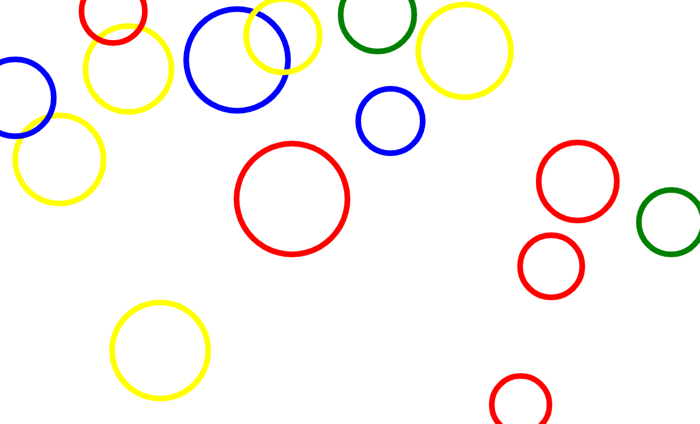

# Liostaí

Go dtí seo bhíomar ag úsáid téacs agus uimhreacha inár ríomhchláir. Bhaineamar úsáid as iad sin chun
rudaí an-tábhachtach a dhéanamh, ach tá siad an-teoranta.

Cad a dhéanfaimid más maith linn go leor píosaí téacs nó go leor uimhreacha a úsáid? Chun é sin a
dhéanamh, ba chóir dúinn **liostaí** a úsáid. Mar a shamhlófá, is féidir linn liostaí a úsáid chun
liosta luachanna a chruthú.

## Ag cruthú liostaí

Déantar liostaí le lúibíní cearnacha (`[`, `]`) timpeall an liosta luachanna, agus camóga (`,`) idir
na baill. Mar shampla: is é `[100, 200, 300]`{.setanta} liosta le 3 bhall; Is é `100`{.setanta} an
chéad bhall, is é `200`{.setanta} an dara ball agus `300`{.setanta} an tríú ball.

Is é `[]`{.setanta} liosta folamh.

Déan iarracht `4` a chur leis an liosta `[1, 2, 3]`{.setanta} mar ceathrú ball anseo:

{{{
scríobh([1, 2, 3])
}}}

[[Cliceáil anseo chun an freagra a fheiceáil|scríobh([1, 2, 3, 4])]]

Sa sampla sin, chruthaíomar liosta uimhreacha, ach is féidir leat liosta a cruthú as aon luachanna
is mian leat, téacs, uimhreacha, luachanna Boole srl.

```{.setanta .numberLines}
[1, 2, 3] >-- Uimhreacha
["Hello", "Goodbye"] >-- Téacs
[["List", "inside"], ["a", "list"]] >-- Liosta liostaí
[10, fíor, "Dia duit"] >-- Meascán cineálacha
```

## Ag cur liostaí le chéile

Is féidir liostaí a chur le chéile leis an oibritheoir `+`. Mar shampla: tá `[10, 20] + [30,
40]`{.setanta} cothrom le `[10, 20, 30, 40]`{.setanta}.

{{{
scríobh([10, 20] + [30, 40])
}}}

Cruthaíonn `+` liosta nua ó na dhá liostaí, cuireann sé an chéad liosta ar dtús, agus an dara liosta
in a dhiaidh sin. Is féidir linn é sin a úsáid chun ball nua a chuir le liosta:

{{{
x := [1, 2, 3]
x = x + [4]
scríobh(x)
}}}

## Míniú

- Ar an chéad líne, cruthaímid liosta nua `[1, 2, 3]`{.setanta}, agus stórálaimid é san athróg `x`.
- Ar an dara líne, nuashonraímid an t-athróg `x` leis an luach `x + [4]`{.setanta}.
  Is é `[1, 2, 3]`{.setanta} luach reatha `x`, dá bhrí sin is é `[1, 2, 3] + [4]`{.setanta} luach
  `x + 4`{.setanta}. Tá `[1, 2, 3] + [4]`{.setanta} cothrom le `[1, 2, 3, 4]`. Mar sin is é an luach
  `x` nua ná `[1, 2, 3, 4]`{.setanta}.
- Ar an tríú líne, scríobhaimid `x`. Ar an gconsól feicimid "[1, 2, 3, 4]".

## Ag fáil baill

Anois tá a fhios againn conas liostaí a chruthú, ach conas is féidir linn na baill a fháil amach as
na liostaí?

Tá baill an liosta uimhrithe. Is é an chéad bhall ball 0, is é an dara ball ball 1, an tríú ball
ball 2 agus araile. Tugaimid "innéacs an bhaill" ar an uimhir sin.


Bainimid úsáid arís as lúibíní cearnacha (`[]`) chun baill an liosta a fháil ag innéacs éigin.
Cuirimid an innéacs idir na lúibíní tar éis an liosta. Mar shampla: má tá liosta againn san athróg
`ár_liosta`, is féidir linn `ár_liosta[0]`{.setanta} a scríobh chun an chéad bhall a fháil (is é 0
innéacs na chéad bhall). Scríobhaimid `ár_liosta[1]`{.setanta} chun a dara ball a fháil, agus
`ár_liosta[2]`{.setanta} chun an tríú ball a fháil. Seo sampla beag:

{{{
>-- Chruthaigh liosta.
liosta := [10, 20, 30, 40]

>-- Faigh innéacs 0 (an chéad bhall).
ball := liosta[0]

scríobh(ball)
}}}

Bain triail as luachanna difriúla don innéacs ar an líne `ball := liosta[0]`{.setanta}.

### Teorainn

Níl ach 4 baill sa liosta `[10, 20, 30, 40]`{.setanta} as an sampla roimhe seo, cad a tharlaíonn má
déanaimid iarracht an cúigiú ball a fháil (innéacs 4)? Bain triail as:

{{{
[10, 20, 30, 40][4]
}}}

Bá chóir duit earráid a fháil cosúil le "Tá 4 thar teorainn an liosta".


Má tá fad L ag liosta éigin, is iad 0, 1, 2, ... L - 1 na innéacs is féidir leat a úsáid.

## Fad

Go minic ba mhaith linn fad liosta éigin a fháil, is féidir linn an focal "fad" a úsáid chun fad an
liosta a fháil. Má tá liosta againn `liosta`, scríobhaimid `fad@liosta`{.setanta} chun fad an liosta
a fháil. Bain triail as anseo:

{{{
scríobh(fad@[1, 2, 3])
}}}

*Níos déanaí feicfimid cad is brí leis an siombail `@`*

Tá fad an liosta an-úsáideach más maith linn an ball deireanach den liosta a fháil. Chonaiceamar
cheana má tá liosta againn le fad L, is é L-1 innéacs an bhaill dheireanaigh. Dá bhrí sin is féidir
linn `liosta[fad@liosta - 1]`{.setanta} a scríobh chun an baill deireanach a fháil. Bain triail as:

{{{
>-- Cruthaigh liosta "l"
l := ["Is", "aoibhinn", "liom", "Setanta"]
>-- Faigh an ball deireanach
scríobh(l[fad@l - 1])
}}}

## Téacs i gcomparáid le liostaí

Is sórt liosta charachtair é píosa téacs, is féidir leat na carachtair ar leith sa téacs a fháil le
slonn innéacs, agus is féidir leat fad an píosa téacs a fháil le `fad` freisin. Mar shampla:

{{{
>-- Scríobh fad an téacs "Setanta"
scríobh(fad@"Setanta")

>-- Scríobh an céad litir de "Dia duit"
scríobh("Dia duit"[0])
}}}

# Lúba

Anois tá liostaí againn, cad is féidir linn a dhéanamh leo? Go príomha bainimid úsáid as uirlisí ar
a dtugtar "lúba". Le lúba is féidir linn rudaí a dhéanamh arís 's arís le gach ball den liosta, mar
shampla ba féidir linn gach ball de liosta éigin a scríobh ar an gconsól, nó suimiú gach uimhir i
liosta eile.

Tá cúpla cineálacha lúba difriúla, ar dtús féachfaimid ar an lúba "le-idir".

## Le-idir

Tugaimid "le idir" ar an cineál lúba seo mar bainimid úsáid as chun lúb **le** athróg éigin **idir**
dhá luachanna.

Scríobhaimid lúb "le idir" mar seo:

```{.setanta .numberLines}
le <athróg> idir (<tús>, <deireadh>) {
    >-- Cód chun ath-ritheadh
}
```

Mar shampla:

```{.setanta .numberLines}
le x idir (0, 10) {
    scríobh(x)
}
```

Seo é cad a dhéanann lúb le-idir:

1. Cruthaíonn an léirmhínitheoir *Setanta* athróg nua, leis an ainm a chur tú tar éis an fhocail
   "le". Tugaimid **an athróg lúibe** ar an athróg seo.
2. Ar dtús cuireann sé an luach "\<tús\>" san athróg lúibe.
3. Ansin ritheann sé an cód idir na lúibíní slabhracha (`{` + `}`).
4. Tar éis an cód sin, méadaíonn sé an luach san athróg lúibe.
5. Déanann sé seic an bhfuil an athróg lúibe cothrom leis an luach "\<deireadh\>". Má tá sé:
   scoireann sé den lúb agus leanann sé ar aghaidh le aon cód tar éis an lúb.
6. Mura bhfuil an athróg lúibe cothrom leis an luach "\<deireadh\>", filleann sé ar ais go dtí an
   céim 3.

Tá an próiseas seo beagáinín casta, ach tá sé níos soiléire le sampla. Féach anois ar an cód seo an
leanas:

## Sampla

{{{
le i idir (0, 5) {
    scríobh(i)
}
scríobh("Críochnaithe")
}}}

Nuair a ritheann tú an cód sin, bá chóir duit a fheiceáil go scríobhann sé "0", ansin "1", "2", "3"
agus "4". Ag an deireadh scríobhann sé "Críochnaithe".

### Míniú

Chun an lúb "le-idir" a rith, chruthaíonn an léirmhínitheoir *Setanta* athróg nua `i`. Is é "i" ainm
na hathróige mar scríobhamar "le **i** idir (0, 5)" ar an gcéad líne. Is féidir linn aon ainm is
mian linn a úsáid. *Is ainm traidisiúnta é "i" ar athróige lúb*.

Ar dtús, cuireann *Setanta* an luach `0`{.setanta} san athróg `i`. Déanann sé é sin mar is é
`0`{.setanta} an chéad luach idir ná lúibíní ar an gcéad líne: is é 0 an luach tosaigh.

Ansin ritheann sé an cód idir `{` agus `}`, is é `scríobh(i)`{.setanta} an cód sin. Dá bhrí sin,
scríobhann sé "0" ar an gconsól.

Ina dhiaidh sin, méadaíonn *Setanta* an luach san athróg lúibe `i`, mar sin anois is é `1`{.setanta}
an luach. Déanann sé seic an bhfuil `i` níos mó ná cothrom leis an luach deiridh (sa cód seo, is é
`5`{.setanta} an luach sin mar is é `5`{.setanta} an dara uimhir idir na lúibíní sa slonn
`le i idir (0, 5)`{.setanta}). Tá `1`{.setanta} níos lú ná `5`{.setanta}, mar sin rithimid an cód
`scríobh(i)`{.setanta} arís agus scríobhann sé "1" ar an gconsól.

Tharlaíonn an rud céanna arís agus arís le `2`{.setanta}, `3`{.setanta} agus `4`{.setanta}.

Faoi dheireadh, nuair atá *Setanta* críochnaithe ag scríobh "4", méadaíonn sé an luach arís go
`5`{.setanta}, ansin déanann sé an seic arís agus anois tá an athróg lúibe cothrom le `5`{.setanta}.
Dá bhrí sin, tuigeann *Setanta* go bhfuil an lúb críochnaithe agus stopann sé ag rith an cód sa lúb:
leanann sé ar aghaidh go dtí an céad céim eile: an líne `scríobh("Críochnaithe")`{.setanta}.
Scríobhann sé "Críochnaithe" ar an gconsól agus anois tá an ríomhchlár thart.

## Ag scríobh baill liosta

Anois feicfimid conas lúb "le-idir" a úsáid le liostaí. Bainfimid úsáid as lúb chun gach ball den
liosta éigin a scríobh.

Tosaímis le liosta gearr:

```{.setanta}
mo_liosta := [1, 2, 3, 4, 5]
```

Tá 5 baill sa liosta sin, ba mhaith linn gach ceann a úsáid, mar sin is gá dúinn gach innéacs a
fháil. Ba chóir dúinn scríobh `mo_liosta[0]`{.setanta} (an chéad bhall), ansin
`mo_liosta[1]`{.setanta}, `mo_liosta[2]`{.setanta}, `mo_liosta[3]`{.setanta} agus
`mo_liosta[4]`{.setanta}. Chun é sin a dhéanamh, ba chóir dúinn lúb a úsáid chun dul ó `0`{.setanta}
go `4`{.setanta}. Chonaiceamar sa sampla roimhe seo gur féidir linn an lúb seo a úsáid chun dul ó
`0`{.setanta} go `4`{.setanta}:

```{.setanta .numberLines}
le i idir (0, 5) {
}
```

Bainimis úsáid as an lúb sin arís chun gach ball den liosta a scríobh, bain triail as:

{{{
mo_liosta := [1, 2, 3, 4, 5]

le i idir (0, 5) {
    scríobh(mo_liosta[i])
}
}}}

Ach anois, cad a tharlaíonn nuair a cuirimid uimhir nua sa liosta? Tá uimhir nua `6`{.setanta} anois
sa liosta, bain triail as arís:

{{{
mo_liosta := [1, 2, 3, 4, 5, 6]

le i idir (0, 5) {
    scríobh(mo_liosta[i])
}
}}}

Ní scríobhann sé amach "6" ar an gconsól! Cén fáth? Ní scríobhann sé é mar stopann an lúb nuair a
sroicheann sé an innéacs 4, agus tá `6`{.setanta} ag innéacs 5. Más maith linn is féidir linn an
`5`{.setanta} sa luach deiridh a mhéadú go `6`{.setanta}, ach an bhfuil bealach níos cliste?

Tabhair faoi deara go raibh `5`{.setanta} cothrom le fad an liosta sa chéad sampla. Ní comhtharlú é
sin! Ba mhaith linn lúb ó innéacs 0 go dtí an innéacs deireanach, agus chonaiceamar cheana gurb é
`fad@mo_liosta - 1`{.setanta} an innéacs deireanach. **Stopann lúb "le-idir" sula sroicheann sé an
luach deiridh**, dá bhrí sin má úsáidimid `fad@mo_liosta`{.setanta} mar an luach deiridh, ba é
`fad@mo_liosta - 1`{.setanta} an innéacs deireanach a scríobhaimid. Sin é go díreach an rud ba
mhaith linn a dhéanamh!

Anois seo é ár gcód:

{{{
mo_liosta := [1, 2, 3, 4, 5, 6]

le i idir (0, fad@mo_liosta) {
    scríobh(mo_liosta[i])
}
}}}

Nuair a ritheann tú é anois, scríobhann sé gach ball den liosta. Bain triail as liosta níos giorra,
nó liosta níos faide!

## Ag suimiú liostaí

Anois, samhlaigh go bhfuil liosta uimhreacha againn, agus ba mhaith linn an suim iomlán a ríomh.

Tosaímis le liosta gearr arís


```{.setanta .numberLines}
mo_liosta := [10, 20, 30]
```

Caithfimid athróg a cruthú chun an suim a stóráil. Tosaímis le luach `0`{.setanta}.

```{.setanta .numberLines}
mo_liosta := [10, 20, 30]

suim := 0

scríobh(suim)
```

Bá mhaith linn dul tríd an liosta ag suimiú an luach san athróg `suim` le gach ball sa liosta mar
seo:

```{.setanta .numberLines}
mo_liosta := [10, 20, 30]

suim := 0

suim = suim + mo_liosta[0]
suim = suim + mo_liosta[1]
suim = suim + mo_liosta[2]

scríobh(suim)
```

Oibríonn an cód sin, ach má fásann an liosta níos faide, caithfimid línte nua a chur isteach. In
ionas na líne sin, is féidir linn liosta cosúil leis an liosta ón roinn roimhe a úsáid, mar seo:

```{.setanta .numberLines}
mo_liosta := [10, 20, 30]

suim := 0

le i idir (0, fad@mo_liosta) {
    suim = suim + mo_liosta[i]
}

scríobh(suim)
```

Anois oibríonn an cód sin le aon liosta. Bain triail as anseo:

{{{
mo_liosta := [10, 20, 30]

suim := 0

le i idir (0, fad@mo_liosta) {
    suim = suim + mo_liosta[i]
}

scríobh(suim)
}}}

### Gearrscríobh

Scríobhamar `suim = suim + mo_liosta[i]` sa cód roimhe seo, ach tá caoi níos giorra ag *Setanta*
chun é sin a dhéanamh, an ráiteas `+=`:

```{.setanta .numberLines}
suim += mo_liosta[i]
```

Ciallaíonn an líne sin agus an líne `suim = suim + mo_liosta[i]` an rud céanna. Tá ráiteas `*=`,
`-=` agus `/=` freisin chun iolrú, dealú agus roinnt a dhéanamh.


## Céimeanna

Is féidir uimhir eile a úsáid le lúb "le-idir", scríobhann tú é tar éis an uimhir tosaigh agus an
uimhir deiridh. Athraíonn an uimhir seo an céim a thógann an lúb nuair a méadaítear an athróg lúibe.

Mar shampla:

{{{
le i idir (0, 11, 2) {
    scríobh(i)
}
}}}

Scríobhann an ríomhchlár sin 0, 2, 4, 6, 8 agus 10. Tabhair faoi deara go bhfuil `2`{.setanta} tar
éis an `0`{.setanta} agus an `11`{.setanta}. Dá bhrí sin méadaíonn an athróg lúibe faoi 2, mar sin
ní feicimid ach 0, 2, 4 srl sa chonsól.

### Ag laghdú

Má tá an luach deiridh *níos lú* ná an luach tosaigh, ní méadaíonn an athróg lúibe, laghdaíonn sé.
Mar shampla:

{{{
le i idir (10, 0) {
    scríobh(i)
}
}}}

# Ealaín ciorcail

Déanaimis anois rud spéisiúil! Bainfimid úsáid as lúba agus an stáitse chun pictiúir áille a
tharraing. Cruthaímis ríomhchlár anois ina féidir leis an úsáideoir uimhir a chlóscríobh isteach,
agus tarraingeoidh an ríomhchlár an méid ciorcail sin go randamach in áiteanna randamach ar an
stáitse, le méideanna fánach freisin.



Ar dtús, tá cúpla gníomhartha agus luachanna ba chór dúinn a fheiceáil sula dtosóimid.

## Randamach

Chun áiteanna randamach a phiocadh, teastaíonn uimhreacha fánacha uainn, ach conas a chruthaíonn tú
uimhir fánach? Ar an dea-uair tá 2 gníomhartha ag *Setanta* chun rudaí randamach a dhéanamh: `rand`
agus `slánuimh_rand`. Is gníomhartha matamaitice iad, mar sin scríobhaimid `rand@mata`{.setanta}
agus `slánuimh_rand@mata`{.setanta} (nó `slanuimh_rand@mata`{.setanta}) chun iad a úsáid.

- Tugann `rand` uimhir randamach dúinn idir 0 agus 1. Mar shampla: 0.5, 0.333 srl.
- Glacann `slánuimh_rand` le 2 argóint, agus tugann sé ar ais slánuimhir randamach idir na
  huimhreacha sin. Mar shampla, is féidir le `slánuimhir_rand@mata(3, 5)` 3, 4, nó 5 a thabhairt ar
  ais.

Bain triail as an cód seo cúpla uair:

{{{
scríobh(slánuimh_rand@mata(0, 100))
}}}

Bá chóir duit uimhreacha difriúla a fheiceáil idir 0 agus 100.

## An Stáitse

Chun áiteanna fánacha a phiocadh amach ar an stáitse, caithfimid leithead an stáitse agus airde an
stáitse a fháil. Mar a chonaiceamar roimhe seo, is féidir linn na luachanna sin a fháil le
`fad_x@stáitse`{.setanta} agus `fad_y@stáitse`{.setanta}.

Bain triail as an cód seo:

{{{
scríobh("Leithead", fad_x@stáitse)
scríobh("Airde", fad_y@stáitse)
}}}

## An Ealaín
