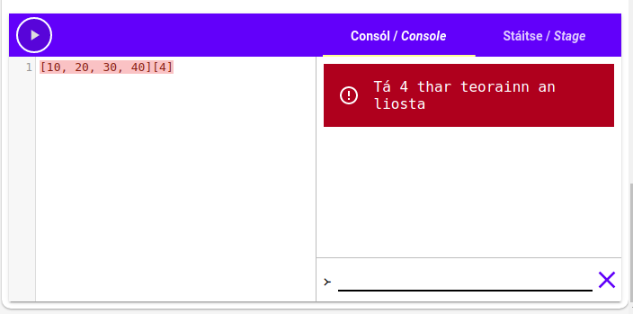

# Liostaí

Go dtí seo bhíomar ag úsáid téacs agus uimhreacha inár ríomhchláir. Bhaineamar úsáid as iad sin chun
rudaí an-tábhachtach a dhéanamh, ach tá siad an-teoranta.

Cad a dhéanfaimid más maith linn go leor píosaí téacs nó go leor uimhreacha a úsáid? Chun é sin a
dhéanamh, ba chóir dúinn **liostaí** a úsáid. Mar a shamhlófá, is féidir linn liostaí a úsáid chun
liosta luachanna a chruthú.

## Ag cruthú liostaí

Déantar liostaí le lúibíní cearnacha (`[`, `]`) timpeall an liosta luachanna, agus camóga (`,`) idir
na baill. Mar shampla: is é `[100, 200, 300]`{.setanta} liosta le 3 bhall; Is é `100`{.setanta} an
chéad bhall, is é `200`{.setanta} an dara ball agus `300`{.setanta} an tríú ball.

Is é `[]`{.setanta} liosta folamh.

Déan iarracht `4` a chur leis an liosta `[1, 2, 3]`{.setanta} mar ceathrú ball anseo:

{{{
scríobh([1, 2, 3])
}}}

[[Cliceáil anseo chun an freagra a fheiceáil|scríobh([1, 2, 3, 4])]]

Sa sampla sin, chruthaíomar liosta uimhreacha, ach is féidir leat liosta a cruthú as aon luachanna
is mian leat, téacs, uimhreacha, luachanna Boole srl.

```{.setanta .numberLines}
[1, 2, 3] >-- Uimhreacha
["Hello", "Goodbye"] >-- Téacs
[["List", "inside"], ["a", "list"]] >-- Liosta liostaí
[10, fíor, "Dia duit"] >-- Meascán cineálacha
```

## Ag cur liostaí le chéile

Is féidir liostaí a chur le chéile leis an oibritheoir `+`. Mar shampla: tá `[10, 20] + [30,
40]`{.setanta} cothrom le `[10, 20, 30, 40]`{.setanta}.

{{{
scríobh([10, 20] + [30, 40])
}}}

Cruthaíonn `+` liosta nua ó na dhá liostaí, cuireann sé an chéad liosta ar dtús, agus an dara liosta
in a dhiaidh sin. Is féidir linn é sin a úsáid chun ball nua a chuir le liosta:

{{{
x := [1, 2, 3]
x = x + [4]
scríobh(x)
}}}

## Míniú

- Ar an chéad líne, cruthaímid liosta nua `[1, 2, 3]`{.setanta}, agus stórálaimid é san athróg `x`.
- Ar an dara líne, nuashonraímid an t-athróg `x` leis an luach `x + [4]`{.setanta}.
  Is é `[1, 2, 3]`{.setanta} luach reatha `x`, dá bhrí sin is é `[1, 2, 3] + [4]`{.setanta} luach
  `x + 4`{.setanta}. Tá `[1, 2, 3] + [4]`{.setanta} cothrom le `[1, 2, 3, 4]`. Mar sin is é an luach
  `x` nua ná `[1, 2, 3, 4]`{.setanta}.
- Ar an tríú líne, scríobhaimid `x`. Ar an gconsól feicimid "[1, 2, 3, 4]".

## Ag fáil baill

Anois tá a fhios againn conas liostaí a chruthú, ach conas is féidir linn na baill a fháil amach as
na liostaí?

Tá baill an liosta uimhrithe. Is é an chéad bhall ball 0, is é an dara ball ball 1, an tríú ball
ball 2 agus araile. Tugaimid "innéacs an bhaill" ar an uimhir sin.


Bainimid úsáid arís as lúibíní cearnacha (`[]`) chun baill an liosta a fháil ag innéacs éigin.
Cuirimid an innéacs idir na lúibíní tar éis an liosta. Mar shampla: má tá liosta againn san athróg
`ár_liosta`, is féidir linn `ár_liosta[0]`{.setanta} a scríobh chun an chéad bhall a fháil (is é 0
innéacs na chéad bhall). Scríobhaimid `ár_liosta[1]`{.setanta} chun a dara ball a fháil, agus
`ár_liosta[2]`{.setanta} chun an tríú ball a fháil. Seo sampla beag:

{{{
>-- Chruthaigh liosta.
liosta := [10, 20, 30, 40]

>-- Faigh innéacs 0 (an chéad bhall).
ball := liosta[0]

scríobh(ball)
}}}

Bain triail as luachanna difriúla don innéacs ar an líne `ball := liosta[0]`{.setanta}.

### Teorainn

Níl ach 4 baill sa liosta `[10, 20, 30, 40]`{.setanta} as an sampla roimhe seo, cad a tharlaíonn má
déanaimid iarracht an cúigiú ball a fháil (innéacs 4)? Bain triail as:

{{{
[10, 20, 30, 40][4]
}}}

Bá chóir duit earráid a fháil cosúil le "Tá 4 thar teorainn an liosta".



Má tá fad L ag liosta éigin, is iad 0, 1, 2, ... L - 1 na innéacs is féidir leat a úsáid.

## Fad

Go minic ba mhaith linn fad liosta éigin a fháil, is féidir linn an focal "fad" a úsáid chun fad an
liosta a fháil. Má tá liosta againn `liosta`, scríobhaimid `fad@liosta`{.setanta} chun fad an liosta
a fháil. Bain triail as anseo:

{{{
scríobh(fad@[1, 2, 3])
}}}

*Níos déanaí feicfimid cad is brí leis an siombail `@`*

Tá fad an liosta an-úsáideach más maith linn an ball deireanach den liosta a fháil. Chonaiceamar
cheana má tá liosta againn le fad L, is é L-1 innéacs an bhaill dheireanaigh. Dá bhrí sin is féidir
linn `liosta[fad@liosta - 1]`{.setanta} a scríobh chun an baill deireanach a fháil. Bain triail as:

{{{
>-- Cruthaigh liosta "l"
l := ["Is", "aoibhinn", "liom", "Setanta"]
>-- Faigh an ball deireanach
scríobh(l[fad@l - 1])
}}}
