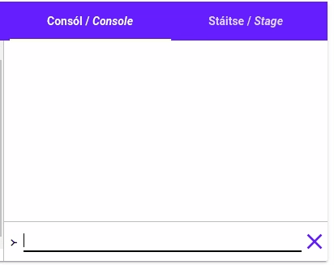

# Lúba "Nuair-a"

Sa leathanach roimhe seo d'fhoghlaimíomar faoi lúba "le idir", bhí siad an-úsáideach le haghaidh
píosaí cód a rith arís agus arís, ach bhí siad teoranta mar bhí orainn an uimhir tosaigh agus an
uimhir deiridh a phiocadh sula dtosaigh an lúb ag rith. Cad is féidir linn a dhéanamh mura bhfuil a
fhios againn cé mhéad lúb atá de dhíth orainn, nó má ba mhaith linn rudaí a dhéanamh go deo?

Is féidir linn cineál lúb nua a úsáid, an lúb *"nuair-a"*. Tugaimid lúb "nuair-a" ar an gcineál lúb
seo mar ritheann an cineál lúb seo cód arís agus arís **nuair a**tá slonn éigin fíor. Tugaimid "an
coinníoll" ar an slonn sin.

Scríobhaimid lúb "nuair-a" mar seo:

```{.setanta .numberLines}
nuair-a <coinníoll> {
    >-- Cód le ath-rith
}
```

Oibríonn lúb "nuair-a" mar seo:

1. Nuair a sroicheann an léirmhínitheoir *Setanta* lúb "nuair-a", ar dtús déanann sé seic an bhfuil
   an coinníoll fíor (cosúil lé ráiteas `má`{.setanta}). Mura bhfuil an coinníoll fíor, scoireann sé
   den lúb agus leanann sé ar aghaidh leis an cód tar éis an lúibe.
2. Tar éis an seic, ritheann sé an cód idir na lúibíní slabhracha (`{` agus `}`).
3. Ansin bogann sé ar ais go céim 1.

Seo sampla beag:

## Sampla


{{{
>-- Cruthaigh athróg nua
x := 0

>-- Is é "x < 3" an coinníoll
nuair-a x < 3 {
    scríobh(x)

    >-- Meadaigh `x` faoi 1
    x += 1
}
}}}

Nuair a ritheann tú an cód sin scríobhann sé "0", "1" agus "2", Cén fáth?

- Ar an gcéad líne, cruthaíonn *Setanta* athróg nua `x` le luach `0`{.setanta}.
- Ansin, leanann sé ar aghaidh agus sroicheann sé an lúb. Is é `x < 3`{.setanta} an coinníoll. Dá
  bhrí sin, déanann *Setanta* seic an bhfuil `x < 3`{.setanta} fíor. Faoi láthair tá `x` cothrom le
  0, mar sin tá `x < 3`{.setanta} fíor.
- Mar bhí an coinníoll fíor, ritear an cód sa lúb, scríobhann sé "0" ar an gconsól agus méadaíonn sé
  `x`. Anois is é `1`{.setanta} luach `x`.
- Anois filleann *Setanta* ar ais go dtí an coinníoll, anois tá `x` cothrom le `1`{.setanta}, mar
  sin tá an coinníoll `x < 3`{.setanta} fós fíor agus leanann sé ar aghaidh leis an cód arís.
- Scríobhann sé "1" ar an gconsól agus méadaíonn sé `x` arís.
- Tharlaíonn an rud cheana arís: tá an coinníoll fós fíor, scríobhann sé "2" agus méadaíonn sé `x`.
- Anois, áfach, níl an coinníoll fíor, mar tá `x` cothrom le `3`{.setanta}, agus níl 3 níos lú na 3.
  Dá bhrí sin, scoireann *Setanta* ón lúb agus leanann sé ar aghaidh tar éis an lúibe.
- Níl aon cód tar éis an lúibe, mar sin tá an ríomhchlár críochnaithe.

## Ag lúbadh go deo

Cad is féidir linn a dhéanamh más mian linn rudaí le dhéanamh go deo? Mar shampla ríomhchlár a
scríobhann "Dia duit" gach 2 soicind? Is féidir linn é sin a dhéanamh, níl le déanamh againn ach
coinníoll a scríobh atá fíor i gcónaí, mar shampla: `1 == 1`{.setanta} nó `2 + 3 == 5`{.setanta}.
Is é `fíor`{.setanta} an rud is simplí áfach.

Seo lúb a ritheann go deo:

```{.setanta .numberLines}
nuair-a fíor {
}
```

Nuair atá ríomhchlár *Setanta* ag rith, athraíonn an cnaipe
<iron-icon class="play" icon="av:play-arrow"></iron-icon> go
cnaipe <iron-icon class="play" icon="av:stop"></iron-icon>. Má cliceálann tú ar an cnaipe, stopfaidh
an ríomhchlár. Beidh an cnaipe seo riachtanach le na ríomhchláir a leanas.

Anois, scríobhaimis an ríomhchlár a scríobhann "Dia duit" gach 2 soicind:

{{{
nuair-a fíor {
    scríobh("Dia duit")
    coladh(2000)
}
}}}

Bain triail as! (Ná déan dearmad faoi an cnaipe <iron-icon class="play" icon="av:stop"></iron-icon>.

# Ag Neadú

Is féidir linn lúba a chur isteach i lúba eile! Tugaimid "lúba neadaithe" ar lúba mar seo. Tá lúba
neadaithe an-úsáideach le haghaidh rudaí casta a dhéanamh. Féach ar an sampla seo:

## Sampla

Seo cód le lúba neadaithe:

{{{
le i idir (0, 3) {
    le j idir (0, 3) {
        scríobh("Amuigh:", i, "Istigh:", j)
    }
}
}}}

Tosaíonn na lúba seo ag 0 agus stopann siad ag 2. Gach uair a ritheann an lúb amuigh, ritheann an
lúb istigh 3 huaire. Bain triail as an cód sin.

## Dathanna agus Méideanna

Anois bainimis úsáid as lúba neadaithe, Samhlaigh go bhfuil liosta dathanna agus liosta méideanna
againn, agus ba mhaith linn ciorcail a tharraing le gach méid agus gach dath.

Tosaímis le liosta dathanna agus lúb amháin chun dul tríd an liosta:

```{.setanta .numberLines}
dathanna := ["glas", "buí", "bándearg", "gorm"]

le i idir (0, fad@dathanna) {
    dath := dathanna[i]

    >-- Athraigh an dath
    dath@stáitse(dath)
}
```

Anois is féidir linn an liosta méideanna a chruthú, agus lúba neadaithe chun dul tríd an liosta.

```{.setanta .numberLines}
dathanna := ["glas", "buí", "bándearg", "gorm"]

méideanna := [50, 100, 200]

le i idir (0, fad@dathanna) {
    dath := dathanna[i]

    >-- Athraigh an dath
    dath@stáitse(dath)

    le j idir (0, fad@méideanna) {
        méid := méideanna[j]
    }
}
```

Anois, sa lúb istigh tá na hathróige `dath` agus `méid` againn, agus is féidir linn ciorcail a
tharraing, ach cén áit?

Chun an ciorcail a tharraing i lár an stáitse is féidir linn `fad_x` agus `fad_y` a úsáid. Chun an
lárphointe a fháil níl le dhéanamh againn ach roinn `fad_x` agus `fad_y` faoi 2.

```{.setanta .numberLines}
dathanna := ["glas", "buí", "bándearg", "gorm"]

méideanna := [50, 100, 200]

le i idir (0, fad@dathanna) {
    dath := dathanna[i]

    >-- Athraigh an dath
    dath@stáitse(dath)

    le j idir (0, fad@méideanna) {
        méid := méideanna[j]

        >-- Glan an stáitse.
        glan@stáitse()

        >-- Tarraing an ciorcal i lár an stáitse.
        ciorcal@stáitse(fad_x@stáitse / 2, fad_y@stáitse / 2, méid)
    }
}
```

Faoi dheireadh, ba chóir dúinn fan ar feadh tamaill beag tar éis dúinn an ciorcal a tharraing.
Ba chóir dúinn é seo a dhéanamh mar mura ndéanaimid é beidh an ríomhchlár i bhfad ró thapa. Ní
bheadh am againn chun na ciorcail ar leith a fheiceáil.

Bain triail as!

{{{s
dathanna := ["glas", "buí", "bándearg", "gorm"]

méideanna := [50, 100, 200]

le i idir (0, fad@dathanna) {
    dath := dathanna[i]

    >-- Athraigh an dath
    dath@stáitse(dath)

    le j idir (0, fad@méideanna) {
        méid := méideanna[j]

        >-- Glan an stáitse.
        glan@stáitse()

        >-- Tarraing an ciorcal i lár an stáitse.
        ciorcal@stáitse(fad_x@stáitse / 2, fad_y@stáitse / 2, méid)

        >-- Codail ar feadh tamall beag.
        codladh(400)
    }
}
}}}

# Stop! {#stad}

Anois déanfaimid iarracht ríomhchlár nua a chruthú a ligeann don úsáideoir liosta téacs a
chlóscríobh go dtí go gclóscríobhann siad "Stop", ansin scríobhfaidh an ríomhchlár an liosta ar ais
ar an gconsól. Féach ar an GIF seo:



Is féidir linn an gníomh `léigh`{.setanta} a úsáid chun ionchur an úsáideora a fháil. Tosaímis le
lúb `nuair-a fíor`{.setanta} agus feicimid níos déanaí conas éalú ón lúb.

```{.setanta .numberLines}
>-- Cruthaigh liosta folamh.
liosta := []

nuair-a fíor {
    >-- Faigh téacs ón úsáideoir.
    téacs := léigh()

    >-- Cuir an téacs leis an liosta.
    liosta += [téacs]
}
```

Má ritear an ríomhchlár sin, leanfaidh sé ar aghaidh go deo ag léigh téacs ón gconsól. Ba mhaith
linn scoir ón lúb nuair a scríobhann an úsáideoir "Stop". Conas is féidir linn é sin a dhéanamh?

## DIY

Má úsáidimid coinníoll éigin in ionad `fíor`{.setanta}, beidh muid ábalta an lúb a stopadh.
Cruthaímis athróg nua `stop` leis an luach `bréag`{.setanta} agus bainimis úsáid as an athróg sin
mar coinníoll an lúibe mar seo:

```{.setanta .numberLines}
>-- Cruthaigh liosta folamh.
liosta := []

stop := bréag

nuair-a !stop {
    >-- Faigh téacs ón úsáideoir.
    téacs := léigh()

    >-- Cuir an téacs leis an liosta.
    liosta += [téacs]
}
```

Anois leanfaidh an lúb ag rith nuair atá `stop` cothrom le `bréag`{.setanta}, agus stopfaidh sé má
tá sé cothrom lé `fíor`{.setanta}. Anois nuair a faighimid téacs ón úsáideoir, is féidir linn an
athróg `stop` a athrú go `fíor`{.setanta} má tá an téacs cothrom le `"Stop"`{.setanta}.

```{.setanta .numberLines}
>-- Cruthaigh liosta folamh.
liosta := []

stop := bréag

nuair-a !stop {
    >-- Faigh téacs ón úsáideoir.
    téacs := léigh()

    má téacs == "Stop" {
        stop = fíor
    } nó {
        >-- Cuir an téacs leis an liosta.
        liosta += [téacs]
    }
}
```

Anois cuirimis líne ag an deireadh chun an liosta a scríobh amach agus beidh ríomhchlár ceart
againn.

{{{
>-- Cruthaigh liosta folamh.
liosta := []

stop := bréag

nuair-a !stop {
    >-- Faigh téacs ón úsáideoir.
    téacs := léigh()

    má téacs == "Stop" {
        stop = fíor
    } nó {
        >-- Cuir an téacs leis an liosta.
        liosta += [téacs]
    }
}
scríobh(liosta)
}}}

Bain triail as! Rith an ríomhchlár agus scríobh isteach cúpla rudaí difriúla, ansin scríobh "Stop"
agus ba chóir duit liosta na rudaí a scríobh tú a fheiceáil sa chonsól.

## An bealach níos fearr

D'oibrigh an cód sin i gceart, ach bhí sé beagáinín casta, an bhfuil bealach níos simplí?

Tá eochairfhocal `bris`{.setanta} ag *Setanta*, is féidir linn é a úsáid chun **bris** amach as lúb
éigin. Nuair a léann an léirmhínitheoir *Setanta* `bris`{.setanta} stopann sé láithreach agus fágann
sé an lúb, ansin leanann sé ar aghaidh le aon cód tar éis an lúibe.

Bain triail as anseo:

{{{
le i idir (0, 10) {
    má i == 5 {
        bris
    }
    scríobh(i)
}
}}}

Má ritheann tú an cód sin, feicfidh tú "0", "1", "2", "3" agus "4" ar an gconsól, cén fáth nach
bhfeiceann tú na huimhreacha eile ("5", "6" srl.)?

Stopann an ríomhchlár ag "4" mar nuair a thosaíonn an lúb le `i` cothrom le `5`{.setanta}, tá an
seic `ma i == 5`{.setanta} fíor. Mar sin ritheann sé an líne `bris`{.setanta}. Ar an bpointe
scoireann *Setanta* ón lúb. Níl aon cód eile tar éis an lúibe, mar sin tá an ríomhchlár
críochnaithe.

### Dúshlán

Bog an líne `scríobh(i)`{.setanta} ionas go scríobhann an ríomhchlár sin "5" freisin.

[[Cliceáil anseo le haghaidh an freagra|Cuir an líne sin roimh an ráiteas &quot;má&quot;]]

### Ag Réitigh Ár gCód

Seo é an cód a scríobhamar níos luaithe:

```{.setanta .numberLines}
>-- Cruthaigh liosta folamh.
liosta := []

stop := bréag

nuair-a !stop {
    >-- Faigh téacs ón úsáideoir.
    téacs := léigh()

    má téacs == "Stop" {
        stop = fíor
    } nó {
        >-- Cuir an téacs leis an liosta.
        liosta += [téacs]
    }
}
scríobh(liosta)
}}}
```

Anois is féidir linn gach rud a bhaineann leis an athróg `stop` a scrios agus an focal
`bris`{.setanta} a úsáid ina ionad. Féach ar an cód anois:

```{.setanta .numberLines}
>-- Cruthaigh liosta folamh.
liosta := []

nuair-a fíor {
    >-- Faigh téacs ón úsáideoir.
    téacs := léigh()

    má téacs == "Stop" {
        bris
    }

    >-- Cuir an téacs leis an liosta.
    liosta += [téacs]
}
scríobh(liosta)
}}}
```

Tá an cód seo i bhfad níos simplí, agus déanann sé an rud céanna.

# Lean ort!

Tá eochairfhocal eile ag *Setanta* a bhaineann le lúba, is é `chun-cinn`{.setanta}. Nuair a
d'úsáideamar `bris`{.setanta}, scoir sé amach ón lúb go hiomlán, ach déanann `chun-cinn`{.setanta}
rud difriúil, nuair a úsáidimid `chun-cinn`{.setanta} bogann *Setanta* ar ais go dtí barr an lúibe
agus tosaíonn sé an lúb arís (leis an gcéad luach eile den athróg lúibe i gcás lúb "le-idir").

Féach ar an ríomhchlár seo:

{{{s
dathanna := ["buí", "gorm", "dubh", "dearg", "bandearg", "glas"]

le i idir (0, fad@dathanna) {
    dath := dathanna[i]

    dath@stáitse(dath)

    x := slánuimh_rand@mata(0, fad_x@stáitse)
    y := slánuimh_rand@mata(0, fad_y@stáitse)

    ciorcal@stáitse(x, y, 100)
}
}}}

Tá liosta dathanna sa ríomhchlár sin, agus péinteálann sé ciorcal ag áit randamach le gach dath sa
liosta.

Cad is féidir linn a dhéanamh más maith linn neamhaird a thabhairt ar gach dath a thosaíonn le "g"?
Ba féidir linn ráiteas `má`{.setanta} mór a úsáid, ach bheadh sé sin an míshlachtmhar. In ionad sin
is féidir linn `chun-cinn`{.setanta} a úsáid chun léim go dtí an gcéad dath eile má dtosaíonn an
dath reatha le "g".

Cuimhnigh gur féidir linn na litreacha ar leith i bpíosa téacs a roghnú le slonn innéacs, díreach
mar a dhéanaimid le liostaí. Chun seic a dhéanamh an bhfuil an céad litir cothrom le "g", is féidir
linn an ráiteas seo a scríobh: `má dath[0] == "g"`{.setanta}. Anois cuirimis an píosa cód seo
isteach inár lúb:

```{.setanta .numberLines}
má dath[0] == "g" {
    chun-cinn
}
```

Seo é an cód anois:

```{.setanta .numberLines}
dathanna := ["buí", "gorm", "dubh", "dearg", "bandearg", "glas"]

le i idir (0, fad@dathanna) {
    dath := dathanna[i]

    má dath[0] == "g" {
        chun-cinn
    }

    dath@stáitse(dath)

    x := slánuimh_rand@mata(0, fad_x@stáitse)
    y := slánuimh_rand@mata(0, fad_y@stáitse)

    ciorcal@stáitse(x, y, 100)
}
```

Anois nuair a thosaíonn an dath le "g", rithfear an líne `chun-cinn`{.setanta}, ansin bogfaidh
léirmhínitheoir *Setanta* ar ais go dtí barr an lúibe, méadóidh sé an athróg lúibe `i` agus
leanfaidh sé ar aghaidh léis an gcéad dath eile. Bain triail as anseo, tabhair faoi deara nach
bhfuil aon ciorcal "glas" nó "gorm"!

{{{s
dathanna := ["buí", "gorm", "dubh", "dearg", "bandearg", "glas"]

le i idir (0, fad@dathanna) {
    dath := dathanna[i]

    má dath[0] == "g" {
        chun-cinn
    }

    dath@stáitse(dath)

    x := slánuimh_rand@mata(0, fad_x@stáitse)
    y := slánuimh_rand@mata(0, fad_y@stáitse)

    ciorcal@stáitse(x, y, 100)
}
}}}
