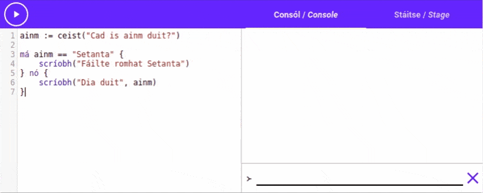

# Roghanna agus Cinntí

Go dtí seo, rinne gach ríomhchlár a scríobhamar an rud céanna. Tosaíonn an léirmhínitheoir ag barr
an ríomhchláir agus téann sé ó líne go líne díreach go dtí an bun.

Más mian linn rudaí níos casta a dhéanamh, ba chóir dúinn cinntí inár ríomhchláir a dhéanamh.

Le haghaidh é sin a dhéanamh, bainimid úsáid go príomha as an ráiteas "`má`{.setanta}". Leis an
ráiteas `má`{.setanta}, is féidir linn rud amháin a dhéanamh má tá slonn éigin fíor, nó rud eile
mura bhfuil.

Scríobhaimid ráiteas `má`{.setanta} mar seo:

```{.setanta .numberLines}
má >-- slonn éigin --< {
    >-- cód le dhéanamh má tá an slonn fíor
} nó {
    >-- cód le dhéanamh má tá an slonn bréagach
}
```

**Ní chaithfidh tú an cuid `nó`{.setanta} a scríobh, tá sé roghnach. Tá cód mar seo ceart freisin:**

```{.setanta .numberLines}
má >-- slonn éigin --< {
    >-- cód le dhéanamh má tá an slonn fíor
}
```

## Sampla

Tosaímis leis an ríomhchlár a scríobhamar cheana. Faigheann an ríomhchlár ainm an t-úsáideoir agus
scríobhann sé é le "Dia duit" ar an gconsól.

```{.setanta .numberLines}
ainm := ceist("Cad is ainm duit?")
scríobh("Dia duit", ainm)
```

Bainimid úsáid as an gníomh `ceist`{.setanta} chun ceist a chuir ar an úsáideoir faoina ainm.
Stórálaimid an freagra i athróg `ainm`{.setanta} agus ansin úsáidimid `scríobh`{.setanta} le
haghaidh an ainm a scríobh ar an gconsól.

Anois athraímis an ríomhchlár chun teachtaireacht speisialta a scríobh más é "Setanta" an ainm.
Bainimid úsáid as an oibritheoir `==`{.setanta} chun dhá píosa téacs a chuir i gcomparáid. Chun an
athróg `ainm` a chuir i gcomparáid le "Setanta", scríobhaimid `ainm == "Setanta"`{.setanta}.

Ansin úsáidimid an ráiteas `má`{.setanta} chun an teachtaireacht speisialta a scríobh más "Setanta"
é an ainm. Féach ar an cód seo:

{{{
ainm := ceist("Cad is ainm duit?")

má ainm == "Setanta" {
    scríobh("Fáilte romhat Setanta")
} nó {
    scríobh("Dia duit", ainm)
}
}}}

Bain triail as an cód sin. Má deirimid gurb é "Setanta" ár n-ainm, scríobhfaidh an ríomhchlár
"Fáilte romhat Setanta". Má deirimid aon rud eile, scríobhfaidh sé "Dia duit".

### Taispeántas



### Míniú

Seo an cód a scríobhamar:

```{.setanta .numberLines}
ainm := ceist("Cad is ainm duit?")

má ainm == "Setanta" {
    scríobh("Fáilte romhat Setanta")
} nó {
    scríobh("Dia duit", ainm)
}
```

- Ar an gcéad líne, faighimid ainm an t-úsáideoir mar a rinneamar cheana.
- Ar an tríú líne, scríobhaimid `má ainm == "Setanta"`{.setanta}. Seiceálann an slonn sin an bhfuil
  luach na hathróige `ainm`{.setanta} cothrom le "Setanta".
- Ar an ceathrú líne, scríobhaimid `scríobh("Fáilte romhat Setanta")`{.setanta}. Rithfear an cód sin
  má tá `ainm`{.setanta} cothrom le "Setanta" mar tá an líne sin idir an chéad péire lúibíní
  slabhra.
- An an cúigiú líne bainimid úsáid as an focal `nó`{.setanta} chun an dara roinn den ráiteas a tosú.
  Rithfear an cód idir an dara péire lúibíní mura bhfuil an seiceáil a rinneamar fíor.
- Ar an líne dheireanach scríobhamar `scríobh("Dia duit", ainm)`{.setanta} mar ba mhaith linn é sin
  a scríobh mura bhfuil `ainm`{.setanta} cothrom le "Setanta".

## Dúshlán

Déan iarracht an ríomhchlár seo a leanas a athrú ionas go scríobhann sé "Is é seacláid an bia is
fearr" má deir an t-úsáideoir gurb é seacláid an bia is fearr leis, agus go scríobhann sé "Is
aoibhinn liom an bia sin" má deir sé aon bia eile.

**Cuimhnigh nach gá duit síneadh fada (áéíóú) a scríobh, is féidir leat `ma`{.setanta} a scríobh in
ionad `má`{.setanta}**.

{{{

bia := ceist("Cad é an bia is fearr leat?")

>-- Cuir do chód anseo

scríobh("Is aoibhinn liom an bia sin")
}}}

[[Cliceáil anseo chun an freagra a fheiceáil |má bia == &quot;Seacláid&quot; { scríobh(&quot;Is é seacláid an bia is fearr&quot;) } nó { scríobh(&quot;Is aoibhinn liom an bia sin&quot;) }]]

# Luachanna Boole

Tá dhá luachanna speisialta ag *Setanta* ar a dtugtar "luachanna Boole" (Ba ollúna matamaitic é
George Boole i gColaiste na hOllscoile Corcaigh), is iad `fíor`{.setanta} agus `bréag`{.setanta}.
(Mar is gnách, is féidir leat `fior`{.setanta} agus `breag`{.setanta} a scríobh mura féidir leat "í"
nó "é" a scríobh).

Is luachanna Boole iad torthaí slonn mar `x == y`{.setanta} nó `bia == "sceallóga"`{.setanta}.

## Comparáidí

Bhaineamar úsáid as an oibritheoir `==` chun seiceáil an bhfuil dhá rud cothrom lena chéile, ach is
féidir linn a lán níos mó a dhéanamh.

Is féidir linn oibritheoirí difriúla a úsáid le haghaidh luachanna a chur i gcomparáid ar bhealaí
éagsúla:

 Oibritheoir    Brí
-------------  -----
`==`           Seiceáil an bhfuil dhá luach cothrom lena chéile
`!=`           Seiceáil nach bhfuil dhá luach cothrom lena chéile.
`>`            Seiceáil an bhfuil an luach ar chlé níos mó ná an cheann ar dheis.
`<`            Seiceáil an bhfuil an luach ar chlé níos lú ná an cheann ar dheis.
`>=`           Seiceáil an bhfuil an luach ar chlé níos mó ná *nó cothrom leis* an cheann ar dheis.
`<=`           Seiceáil an bhfuil an luach ar chlé níos lú ná *nó cothrom leis* an cheann ar dheis.

Is é `fíor`{.setanta} toradh na hoibritheoirí sin má tá an seiceáil fíor, agus `bréag`{.setanta}
mura bhfuil.

Bain triail as an cód seo:

{{{
scríobh(5 <= 3)
}}}

Bá chóir duit a fheiceáil go scríobhann sé "bréag" ar an gconsól. Déanann sé sé sin mar níl `5` níos
mó nó cothrom le `3`.

## Dúshlán

Seo píosa cód páirteach, Cuir oibritheoir ceart in ionad `>-- oibritheoir anseo --<`{.setanta} ionas
go déanann an cód seiceáil an bhfuil `100`{.setanta} níos lú ná `20 * 6 - 18 * (2 * 1/2)`{.setanta}.

{{{
scríobh(100 >-- oibritheoir anseo --< 20 * 6 - 18 * (2 * 1/2))
}}}

[[Cliceáil anseo le haghaidh an freagra|scríobh(100 &lt; 20 * 6 - 18 * (2 * 1/2))]].

Bá chóir go scríobhann an cód "fíor".

## Agus/Nó/Ní

Cad a dhéanfaimid más maith linn níos mó ná rud a amháin a seiceáil? Mar shampla, cad a
scríobhfaimid chun seiceáil an bhfuil aois éigin níos mó na 20, nó níos lú na 10?

Déanfaimid é sin lé trí oibritheoir cumhachtach: `&`{.setanta} ("agus"), `|`{.setanta} ("nó") agus
`!`{.setanta} ("ní").

### Agus

Bainimid úsáid as `&`{.setanta} nuair ba mhaith linn seiceáil an bhfuil dhá slonn fíor. Is é
`fíor`{.setanta} toradh an t-oibritheoir nuair atá an slonn ar chlé fíor, agus an slonn ar dheis.

Mar shampla:

{{{
scríobh("Dia duit" == "Dia duit" & 5 > 2)
scríobh("Dia duit" == "Dia duit" & 5 > 6)
scríobh("Dia duit" == "Slán" & 5 > 2)
scríobh("Dia duit" == "Slán" & 5 > 6)
}}}

Má ritheann tú an cód sin, scríobhann sé "fíor" ar an gcéad líne, agus ansin scríobhann sé "bréag"
trí huaire. Déanann sé sin mar:

1. Ar an gcéad líne, tá `"Dia duit" == "Dia duit"`{.setanta} **agus** `5 > 2`{.setanta} fíor. Mar
   sin, is é `fíor`{.setanta} toradh an slonn ar fad.
2. Ar an dara líne, tá `"Dia duit" == "Dia duit"`{.setanta} fós fíor, ach anois níl `5 > 6` fíor.
   Mar sin, is é `bréag`{.setanta} toradh an slonn ar fad.
3. Ar an tríú líne, níl `"Dia duit" == "Slán"`{.setanta} fíor, mar sín scríobhann sé "bréag".
4. Ar an gceathrú líne, tá `"Dia duit" == "Slán"`{.setanta} agus `5 > 6`{.setanta} bréagach, dá
   bharr sin scríobhann sé "bréag".

### Nó

Úsáidimid an oibritheoir `|`{.setanta} chun seiceáil a dhéanamh an bhfuil ceann amháin de dhá slonn
fíor ar a laghad. Tá toradh an slonn `fíor`{.setanta} má tá an slonn ar chlé **nó** an slonn ar
dheis `fíor`{.setanta}.

Mar shampla:

{{{
scríobh("Dia duit" == "Dia duit" | 5 > 2)
scríobh("Dia duit" == "Dia duit" | 5 > 6)
scríobh("Dia duit" == "Slán" | 5 > 2)
scríobh("Dia duit" == "Slán" | 5 > 6)
}}}

Rith an cód sin agus feicfidh tú go scríobhann sé "fíor", "fíor", "fíor" agus "bréag".

1. Ar an gcéad líne, tá `"Dia duit" == "Dia duit"`{.setanta} agus `5 > 2`{.setanta} fíor. Mar
   sin, is é `fíor`{.setanta} toradh an slonn ar fad.
2. Ar an dara líne, tá `"Dia duit" == "Dia duit"`{.setanta} fós fíor. Mar sin, is é
   `bréag`{.setanta} toradh an slonn ar fad mar tá slonn amháin fíor ar a laghad.
3. Ar an tríú líne, níl `"Dia duit" == "Slán"`{.setanta} fíor ach tá `5 > 2`{.setanta} fíor, mar sín
   scríobhann sé "fíor".
4. Ar an gceathrú líne, tá `"Dia duit" == "Slán"`{.setanta} agus `5 > 6`{.setanta} bréagach, dá
   bharr sin níl ceachtar slonn fíor agus scríobhann an ríomhchlár "bréag".

### Ní

Faoi dheireadh, féachaimis ar an oibritheoir `!`{.setanta}. Tá an oibritheoir seo an-simplí, glacann
sé le luach Boole agus tugann sé ar ais an luach Boole eile. Mar shampla, tá `!fíor`{.setanta}
cothrom le `bréag`{.setanta}, agus tá `!bréag` cothrom le `fíor`{.setanta}.

Bainimid úsáid as an oibritheoir sin nuair ba mhaith linn seiceáil an bhfuil slonn éigin bréagach:


```{.setanta .numberLines}
má !(6 > 10) {
    scríobh("Níl 6 níos mó ná 10")
}
```

# Seiceáil i ndiaidh seiceáil

Is féidir leat `má`{.setanta} agus `nó`{.setanta} a úsáid le chéile chun níos mó ná seiceáil amháin
a dhéanamh. Le sin is féidir leat cúpla coinníoll éagsúla a seiceáil.

Mar shampla, seo ríomhchlár gearr a ghlacann le aois an úsáideora. Má tá an úsáideoir níos sine ná
18, scríobhann sé "Is duine fásta thú". Mura bhfuil an úsáideoir níos sine ná 18, ach *tá* sé níos
sine ná nó cothrom le 13, scríobhann sé "Is déagóir thú". Mura bhfuil an úsáideoir níos sine ná 18
**nó** níos sine ná 13, scríobhann an ríomhchlár "Is páiste thú".

Bain triail as:

{{{
aois := go_uimh(ceist("Cén aois thú?"))

má aois > 18 {
    scríobh("Is duine fásta thú")
} nó má aois >= 13 {
    scríobh("Is déagóir thú")
} nó {
    scríobh("Is páiste thú")
}
}}}

Bain triail as cúpla aois difriúla!

## Míniú

Conas a oibríonn an ríomhchlár sin? Féach ar an ríomhchlár arís, le níos mó tráchtanna.

```{.setanta .numberLines}
>-- Faigh aois an úsáideora
aois := go_uimh(ceist("Cén aois thú?"))

má aois > 18 { >-- An bhfuil an aois níos mó ná 18?
    scríobh("Is duine fásta thú")
} nó má aois >= 13 { >-- Níl sé níos mó ná 18, ach an bhfuil sé níos mó ná 13?
    scríobh("Is déagóir thú")
} nó { >-- Níl sé níos mó ná 18 nó 13, da bhrí sin is páiste é.
    scríobh("Is páiste thú")
}
```

*Tabharfaimid neamhaird ar an gcéad líne ar dtús, ach caithfimid súil air níos déanaí.*

1. Ar líne 4, déanann an ríomhchlár seiceáil an bhfuil an aois níos mó ná 18
   (`aois > 18`{.setanta}).
   - Má tá an aois níos mó ná 18, ritear an cód idir an `{` agus `}`. Sin an líne
     `scríobh("Is duine fásta thú")`{.setanta} amháin. Ansin ní dhéanann sé aon seiceáil eile, tá an
     ríomchlár criochnaithe.
   - Mura bhfuil an aois níos mó ná 18, leanann sé ar aghaidh leis na seiceáil eile.
2. Ar líne 6, déanann an ríomhchlár seiceáil an bhfuil an aois níos mó ná 13
   (`aois > 13`{.setanta}).
   - Má tá an aois níos mó ná 13, ritear an cód idir an `{` agus `}` a leanann an seiceáil. Sin an
     líne `scríobh("Is déagóir thú")`{.setanta}. **Tá a fhios againn gur déagóir é an úsáideoir már
     tá a fhios againn nach bhfuil an aois níos mó ná 18**. Ansin ní dhéanann sé aon seiceáil eile,
     tá an ríomchlár criochnaithe.
   - Mura bhfuil an aois níos mó ná 13, leanann sé ar aghaidh go dtí an roinn deireanach.
3. Ar líne 8, tosóimid an roinn cód deireanach. Ritear an píosa cód seo nuair nach raibh an dhá
   seiceáil roimhe seo fíor. Scríobhann an ríomhchlár "Is páiste thú" mar tá a fhios againn ag an
   bpointe seo níl an úsáideoir níos sine ná 18 nó 13.

### An chéad líne

Féach arís ar an gcéad líne: `aois := go_uimh(ceist("Cén aois thú?"))`{.setanta}. Cad atá ar siúl ar
an líne sin?

Scríobhamar an líne sin le haghaidh aois an úsáideora a fháil.

- Ar dtús, bainimid úsáid as an gníomh `ceist`{.setanta} chun an cheist "Cén aois thú" a chuir.
  Nuair a scríobhann an úsáideoir freagra isteach sa bhosca, is é an freagra sin toradh an gnímh.

  Mar shampla, má scríobhann an úsáideoir "25" isteach, is é `"25"`{.setanta} toradh an gnímh.
- Tá an pointe seo an-tábhachtach. Is píosa **téacs** é toradh an gnímh, ní uimhir é. Tá difríocht
  idir `"25"`{.setanta} agus `25`{.setanta}. Caithfimid an téacs a athrú go uimhir más maith linn é
  a chuir i gcomparáid le `18`{.setanta} agus `13`{.setanta} mar ní féidir leat píosa téacs a chuir
  i gcomparáid le uimhir.

  Chun é sin a dhéanamh, bainimid úsáid as gníomh nua `go_uimh`{.setanta}. Is giorrúchán é
  `go_uimh`{.setanta} ar "go uimhir". Tógann an gníomh seo píosa téacs agus cuireann sé ar ais an
  uimhir a sheasann an téacs dó.

  Mar shampla: Tá an slonn seo fíor: `go_uimh("42") == 42`{.setanta}.

- Anois is féidir linn an líne a thuiscint:
  `aois := go_uimh(ceist("Cén aois thú?"))`{.setanta}. Tógaimid toradh an gníomh `ceist`{.setanta}
  agus tugaimid é díreach go `go_uimh`{.setanta} chun aois an úsáideora a fháil. Ansin cuirimid an
  toradh isteach san athróg `aois`{.setanta}.
