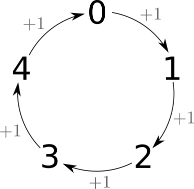
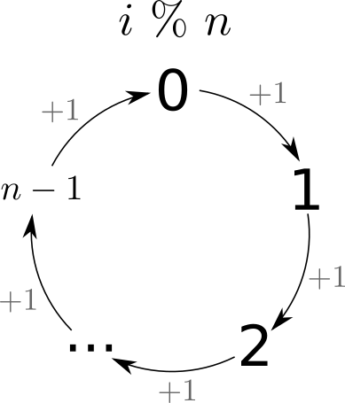
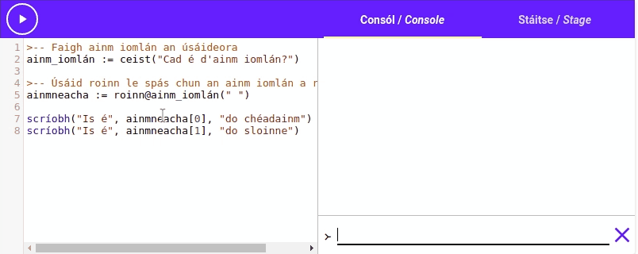

# Mata

Go dtí seo chonaiceamar go leor gníomhartha difriúla (`codladh`{.setanta}, `scríobh`{.setanta}
srl.). Sula leanaimid ar aghaidh le níos mó [[gnéithe|features]] *Setanta*, ba chóir dúinn fanacht
ar feadh nóiméad agus féachaint ar cúpla gníomhartha agus oibritheoirí úsáideacha eile.

## Níos mó oibritheoirí

Chonaiceamar níos luaithe sa teagasc seo na hoibritheoirí `+`, `-`, `*` agus `/`. Tá dhá
oibritheoirí matamaitice eile ag *Setanta*, an oibritheoir "modulo" (`%`) agus an oibritheoir
[[roinnt-slánuimhreacha|integer division]] (`//`).

### Modulo

Is oibritheoir [[neamhghnách|unusual]] é an oibritheoir modulo (`%`), ach tá sé an-úsáideach.

Glacann an oibritheoir sin le dhá uimhir, [[roinneann sé|it divides]] an chéad ceann leis an dara
agus tugann sé ar ais an [[fuílleach|remainder]].

Mar shampla: tá `7 % 2`{.setanta} cothrom le `1`{.setanta} mar nuair a roinneann tú `7`{.setanta} le
`2`{.setanta}, tá an fuílleach cothrom le `1`{.setanta} (mar tá `7 == 3*2 + 1`{.setanta}). Mar an
gcéanna, tá `11 % 4`{.setanta} cothrom le `3`{.setanta} mar tá `11 == 2*4 + 3`{.setanta}.

#### Corr nó Réidh?

Tá an oibritheoir seo úsáideach mar is féidir linn é a úsáid le haghaidh a lán rudaí a dhéanamh. Mar
shampla: is féidir linn é a úsáid chun seiceáil an bhfuil uimhir éigin [[corr|odd]] nó
[[réidh|even]]. Chun é sin a dhéanamh níl ach le déanamh againn ach seiceáil cad é an fuílleach
nuair a roinneann tú an uimhir faoi 2. Má tá an fuílleach cothrom le 0, is uimhir réidh é mar is
féidir linn an uimhir a roinn faoi 2 gan fuílleach. Má tá sé cothrom le 1 is uimhir corr é. Bain
triail as an ríomhchlár seo:

{{{
le i idir (0, 10) {
    má i % 2 == 0 {
        scríobh("Is uimhir réidh é", i)
    } nó {
        scríobh("Is uimhir corr é", i)
    }
}
}}}

#### An bhfuil sé [[príomha|prime]]?

Is féidir linn an oibritheoir modulo `%` a úsáid chun seic a dhéanamh an féidir leat uimhir a roinnt
faoi uimhir eile (má tá `x % y == 0`{.setanta}, is féidir leat `x` a roinn faoi `y`). Is féidir linn
an cumas seo a úsáid chun seiceáil an bhfuil uimhir éigin [[príomha|prime]].

Is uimhir príomha é uimhir lé 2 fhachtóir, an uimhir féin agus 1. Chun seic a dhéanamh an bhfuil
uimhir príomha is féidir linn an [[méid fachtóirí a chomhaireamh|count the number of factors]] mar
seo:

```{.setanta .numberLines}
gníomh príomha(x) {
    >-- Athróg don méid fachtóirí
    fachtóirí := 0

    >-- Déan seic ar gach uimhir idir 1 agus x
    le i idir (1, x + 1) {
        >-- Má tá an seic seo fíor, is féidir leat roinn x faoi i.
        >-- Mar sin is fachtóir é i.
        má x % i == 0 {
            fachtóirí += 1
        }
    }

    >-- Má tá fachtóirí == 2, is uimhir príomha é x.
    >-- Mura bhfuil sé, ní uimhir príomha é x.
    toradh fachtóirí == 2
}
```

Bain triail as an cód sin le cúpla uimhir:

{{{
gníomh príomha(x) {
    >-- Athróg don méid fachtóirí
    fachtóirí := 0

    >-- Déan seic ar gach uimhir idir 1 agus x
    le i idir (1, x + 1) {
        >-- Má tá an seic seo fíor, is féidir leat roinn x faoi i.
        >-- Mar sin is fachtóir é i.
        má x % i == 0 {
            fachtóirí += 1
        }
    }

    >-- Má tá fachtóirí == 2, is uimhir príomha é x.
    >-- Mura bhfuil sé, ní uimhir príomha é x.
    toradh fachtóirí == 2
}

uimhir := go_uimh(ceist("Roghnaigh uimhir: "))
má príomha(uimhir) {
    scríobh("Is uimhir príomha é", uimhir)
} nó {
    scríobh("Ní uimhir príomha é", uimhir)
}
}}}

#### Liostaí gan teorainn

Léigh an ríomhchlár seo agus smaoinigh faoin [[seicheamh uimhreacha|sequence of numbers]] a
scríobhann sé.

{{{
le i idir (0, 15) {
    fuílleach_5 := i % 5
    scríobh(i, " % 5 ==", fuílleach_5)
}
}}}


Scríobhann an ríomhchlár sin fuílleach gach uimhir idir 0 agus 15 nuair a roinneann tú iad faoi 5.
Má léann tú an seicheamh uimhreacha a scríobhann sé feicfidh tú an seicheamh "0", "1", "2", "3",
"4", ansin tosaíonn sé ar ais ag "0" agus leanann sé ar aghaidh sa treo céanna: "1", "2", "3"
"4", "0" ... srl.



Má ritheann tú an ríomhchlár sin le [[raon uimhreacha|range of numbers]] níos mó feicfidh tú an
patrún céanna.  Níl tharlaíonn an [[patrún|pattern]] sin le `i % 5`{.setanta} amháin, má dhéanann tú
an rud céanna le uimhir éigin `n`, [[gheobhaidh tú|you will get]] an seicheamh `0, 1, 2 ... n - 1,
0, 1, 2, ..., n - 1, ...`{.setanta} srl.



Is féidir linn an patrún seo a úsáid chun dul thar liosta arís agus arís, cosúil go
[[liosta gan teorainn|infinite list]] é:

Féach ar gcód seo:

{{{
liosta := ["Gaeilge", "Béarla", "Fraincis"]

le i idir (0, 10) {
    scríobh(liosta[i])
}
}}}

Scríobhann an ríomhchlár sin baill an liosta ach ansin baineann sé triail an [[ball|member]] ag an
innéacs `3`{.setanta} a roghnú agus [[teipeann air|it fails]] mar tá `3` ró mhór. Ach, má úsáidimid
an oibritheoir modulo `%` chun dul ar ais go `0` nuair a [[shroichimid|we reach]] deireadh an liosta
beidh gach rud ceart go leor. Tá fad an liosta cothrom le `3`{.setanta}, dá bhrí sin beidh `i %
fad@liosta`{.setanta} cothrom le `0`{.setanta}, `1`{.setanta} nó `2`{.setanta} [[i gcónaí|always]].
Bain triail as ár gcód nua:

{{{
liosta := ["Gaeilge", "Béarla", "Fraincis"]

le i idir (0, 10) {
    scríobh(liosta[i % fad@liosta])
}
}}}

Anois ní theipeann ar an ríomhchlár nuair a shroicheann sé deireadh an liosta, in ionad sin téann
sé ar ais go dtí an tús. Bain triail as teanga nua a chuir leis an liosta agus an cód a rith arís,
feicfidh tú go dhéanann sé an rud céanna: rachaidh an lúb thar an liosta arís agus arís.

### [[Roinnt Slánuimhreacha|Integer Division]]

Níos luaithe sa teagasc seo, chonaiceamar an [[oibritheoir roinnte|division operator]] (`/`): mar
shampla: `10 / 5 == 2`{.setanta}.

Tá oibritheoir eile againn atá an cosúil leis an oibritheoir roinnte, an oibritheoir roinnt
slánuimhreacha: `//`. Oibríonn sé mar an gcéanna, ach tar éis dó na huimhreacha a roinnt
[[slánaíonn sé an uimhir síos|it rounds the number down]]. Dá bhrí sin faigheann tú
[[slánuimhir|integer]] i gcónaí.

Mar shampla: tá `5 / 2`{.setanta} cothrom le `2.5`{.setanta}, ach tá `5 // 2`{.setanta} cothrom le
`2`{.setanta}; Tá `10 / 3`{.setanta} cothrom le `3.333`{.setanta} ach tá `10 // 3`{.setanta} cothrom
le `3`{.setanta}.

## Gníomhartha Matamaitice

Chonaiceamar roinnt gníomhartha matamaitice cheanna sa teagasc seo, go háirithe
`rand@mata`{.setanta} agus `slánuimh_rand@mata`{.setanta}, áfach, tá a lán níos mó gníomhartha agus
luachanna matamaitice ar fáil i *Setanta*.

Seo liosta gearr do na gníomhartha agus luachanna atá ar fáil, bá chóir duit `@mata`{.setanta} a
úsáid chun iad a roghnú, mar shampla `fréamh@mata`{.setanta}.

### Luachanna

| Ainm | Cur síos | Sampla
|:------|:-----:|----:|
| `pí` | An [[tairiseach|constant]] Pí (3.1415...) | `2 * pí@mata * r`{.setanta} |
| `e` | An tairiseach e (an uimhir Euler) (2.71828...) | `cmhcht@mata(e@mata, 2)`{.setanta} |

### Gníomhartha

| Ainm | Cur Síos agus Sampla |
|:------|:-----:|
| `fréamh` | An [[fréamh cearnach|square root]] (√) |
|          | **m.sh.** `fréamh@mata(4) == 2`{.setanta} |
| `cearn` | [[Feidhm|function]] cearnach (`x²`) |
|         | **m.sh.** `cearn@mata(2) == 4`{.setanta} |
| `dearbh` | Feidhm [[dearbhluacha|absolute value]] (`|x|`) |
|          | **m.sh.** `dearbh@mata(-2) == 2`{.setanta} |
| `eas` | Feidhm [[easpónantúile|exponential]] (`e^x`) |
|       | **m.sh.** `eas@mata(1) == e@mata`{.setanta} |
| `cmhcht` | Feidhm [[cumhachta|power]] (`x^y`) |
|          | **m.sh.** `cmhcht@mata(2, 4) == 16`{.setanta} |
| `log` | Feidhm [[logartaim|logarithm]] |
|       | **m.sh.** `log@mata(2)`{.setanta} |
| `logb` | [[Logartam i mbun éigin|logarithm in some base]] |
|        | **m.sh.** `logb@mata(16, 2) == 4`{.setanta} |
| `sin`  | Feidhm Sine |
|        | **m.sh.** `sin@mata(pi@mata/2)`{.setanta} |
| `cos`  | Feidhm Cosine |
|        | **m.sh.** `cos@mata(0)`{.setanta} |
| `tan`  | Feidhm [[Tangaint|Tangent]] |
|        | **m.sh.** `tan@mata(pi@mata)`{.setanta} |
| `asin` | Feidhm sine [[inbhéarta|inverse]] |
|        | **m.sh.** `asin@mata(0)`{.setanta} |
| `acos` | Feidhm cosine inbhéarta |
|        | **m.sh.** `acos@mata(pi@mata)`{.setanta} |
| `atan` | Feidhm tangaint inbhéarta |
|        | **m.sh.** `atan@mata(0)`{.setanta} |
| `rand` | Uimhir randamach idir 0 agus 1 |
|        | **m.sh.** `rand@mata()`{.setanta} |
| `slánuimh_rand` | Slánuimhir randamach i raon éigin |
|                 | **m.sh.** `slánuimh_rand@mata(5, 10)`{.setanta} |

# Téacs

Tá a fhios againn faoi conas `+` a úsáid chun dhá píosa téacs a chur le chéile, conas
`fad`{.setanta} a úsáid chun fad an phíosa téacs a fháil agus conas
[[slonn innéacs|index expression]] a úsáid chun [[carachtair|characters]] an píosa téacs a roghnú.
Áfach, is féidir linn a lán níos mó a dhéanamh le téacs. Féachfaimid anois ar roinnt gníomhartha
úsáideach:

## `go_téacs`

Is féidir linn `go_téacs` a úsáid chun aon luach a athrú go
[[léiriú téacsúil|textual representation]]. Mar shampla: tá `go_téacs([1, 2, 3])`{.setanta} cothrom
le `"[1, 2, 3]"`{.setanta} agus tá `go_téacs(scríobh)`{.setanta} cothrom le `"<gníomh
scríobh>"`{.setanta}.

## Athchuir

Is féidir linn an gníomh `athchuir` a úsáid chun cuid den píosa téacs a athrú go píosaí téacs eile.
Mar shampla ba féidir linn [[aghaidh shona|happy face]] ":)" a chuir i bpíosa téacs in ionad gach
[[aghaidh brónach|sad face]] ":(".

Cuimhnigh anois caithfimid "@" a úsáid le píosa téacs chun fad an píosa a téacs a fháil mar seo:
`fad@"Sligeach"`{.setanta}. Sa chaoi chéanna, caithfimid "@" a úsáid chun `athchuir` a úsáid.

Seo cúpla sampla conas `athchuir` a úsáid:

{{{
ár_téacs := "Dia duit :("

>-- Cuir ":)" in ionad ":(" san athróg ár_téacs
scríobh(athchuir@ár_téacs(":(", ":)"))

>-- Cuir "Slán" in ionad "Dia duit" san athróg ár_téacs
scríobh(athchuir@ár_téacs("Dia duit", "Slán"))
}}}

## Roinn

Is féidir linn an gníomh `roinn` a úsáid chun píosa téacs a roinn i [[fo-píosaí|sub pieces]]. Is
féidir linn carachtar éigin a roghnú agus nuair a glaoimid ar `roinn` leis an gcarachtar, faighimid
ar ais liosta le gach cuid den píosa téacs atá [[scartha óna gcéile|separated from each other]] leis
an gcarachtar sin.

Mar shampla: is féidir linn `roinn` a úsáid le [[camóg|comma]] (",") chun píosa téacs cosúil le
`"Setanta,Python,Java"`{.setanta} a roinn agus an liosta `["Setanta", "Python", "Java"]`{.setanta} a
fháil. Is féidir linn `roinn` a úsáid le [[spás|space]] (" ") chun abairt éigin a roinn ina
[[fhocail ar leith|individual words]].

Bain triail as an ríomhchlár seo:

{{{
>-- Faigh ainm iomlán an úsáideora
ainm_iomlán := ceist("Cad é d'ainm iomlán?")

>-- Úsáid roinn le spás chun an ainm iomlán a roinn.
ainmneacha := roinn@ainm_iomlán(" ")

scríobh("Is é", ainmneacha[0], "do chéadainm")
scríobh("Is é", ainmneacha[1], "do sloinne")
}}}



## Cuid

Leis an gníomh `cuid`, is féidir linn [[cuid|part]] a bhaint amach as píosa téacs. Glacann an gníomh
le 2 [[innéacs|index]] mar argóintí agus tugann sé an fo-píosa téacs idir na innéacs sin.
([[Cuimsíonn sé|It includes]] an chéad innéacs, ach ní chuimsíonn sé an dara cheann).

Mar shampla: Tá `cuid@"Setanta"(1, 4)`{.setanta} cothrom le `"eta"`{.setanta} mar is é "eta" an
téacs idir an innéacs 1 agus 4 i "Setanta". (S**eta**nta).

## go_liosta

Glacann an gníomh `go_liosta` le píosa téacs, agus tugann sé liosta ar ais le gach carachtar ón
bpíosa téacs ar leith. Mar shampla: Tá `go_liosta("Setanta")`{.setanta} cothrom le `["S", "e", "t",
"a", "n", "t", "a"]`{.setanta}.

# Liostaí

Oibríonn roinnt gníomhartha téacs le liostaí freisin, mar shampla `cuid`, ach tá roinnt gníomhartha
[[breise|extra]] ag liostaí:

## Sórtáil

Is féidir an gníomh `sórtáil` a úsáid chun liosta a sórtáil (
[[mar a shamhlófá|as you could imagine]]). Cuireann `sórtáil` an liosta in
[[ord méadaitheach|increasing order]]. Mar shampla tá `sórtáil@[1, 3, 2]`{.setanta} cothrom le `[1,
2, 3]`{.setanta}.

**NB: Tugann `sórtáil` an liosta sórtáilte ar ais, ach athráionn sé an liosta freisin. Ní cruthaíonn
sé liosta nua: athráíonn sé ord an liosta go díreach.**

## Nasc

Déanann an gníomh `nasc` an [[rud contrártha|opposite thing]] den gníomh `roinn`. Cruthaíonn sé
píosa téacs ó liosta.  Glacann sé le carachtar éigin agus cruthaíonn sé píosa téacs ó liosta, leis
an gcarachtar sin idir gach ball den liosta.

Mar shampla: tá `nasc@[1, 2, 3](", ")`{.setanta} cothrom le `"1, 2, 3"`{.setanta}.

# An Doiciméadacht

Tá an liosta iomlán de na gníomhartha agus luachanna ar fáil ar
[docs.try-setanta.ie](https://docs.try-setanta.ie).
