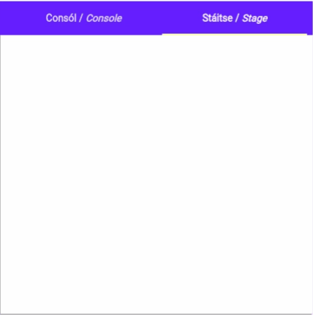

# Mouse Events

*Setanta* doesn't just limit you to using the keyboard for your programs, you can use the
[[mouse|luch]] too! Let's use the *Setanta* mouse events to make a program that lets us draw on the
stage with our mouse.




## The Events

*Setanta* provides three different types of mouse events we can listen for: Mouse down, Mouse move
and mouse up.

- **Mouse down**: Mouse down events are triggered when the mouse click is pressed on the stage.
- **Mouse move**: Mouse move events are triggered when the mouse is moved over the stage.
- **Mouse up**: Mouse up events are triggered when the mouse click is released.

## The Strategy

To make our drawing program, we will keep track of when the mouse is clicked, but hasn't been
released yet. Then when the mouse is moved we will draw on the stage.

# Listeners

Let's make our listener actions. We'll call these `éist_síos`, `éist_suas` and `éist_bog`. "Éist"
translates as "listen", "síos" means down, "suas" means up, and "bog" means move.

Each of these listener actions should take two arguments, `x` and `y`. These are the `x` and `y`
positions of the event.

```{.setanta .numberLines}
gníomh éist_síos(x, y) {
    >-- Code to execute when the mouse is pressed
}

gníomh éist_suas(x, y) {
    >-- Code to execute when the mouse is released
}

gníomh éist_bog(x, y) {
    >-- Code to execute when the mouse is moved
}
```

The actions that actually tell *Setanta* to use actions with the mouse events are called
`luch@stáitse`{.setanta} for the mouse down event, `luch_suas@stáitse` for the mouse up event and
`luch_bog@stáitse` for the mouse move event.

We call these actions and pass them our listener actions.

```{.setanta .numberLines}
gníomh éist_síos(x, y) {
    >-- Code to execute when the mouse is pressed
}

gníomh éist_suas(x, y) {
    >-- Code to execute when the mouse is released
}

gníomh éist_bog(x, y) {
    >-- Code to execute when the mouse is moved
}

luch@stáitse(éist_síos)
luch_suas@stáitse(éist_suas)
luch_bog@stáitse(éist_bog)
```

Let's add a variable at the top of the program called "`brúite`" (which means "pressed"), this variable will store whether the
mouse is currently pressed down or not.

When the mouse is clicked down, we should make this value true (`fíor`{.setanta}), and when it's
released we should change it to false (`bréag`{.setanta}).

The `éist_síos` action will be called when the mouse is clicked, so we should make `brúite` true in
there. The `éist_suas` action will be called when the mouse is release, so we should make `brúite`
false in that action.

```{.setanta .numberLines}
>--  Is the mouse pressed?
brúite := bréag

gníomh éist_síos(x, y) {
    brúite = fíor
}

gníomh éist_suas(x, y) {
    brúite = bréag
}

gníomh éist_bog(x, y) {
    >-- Code to execute when the mouse is moved
}

luch@stáitse(éist_síos)
luch_suas@stáitse(éist_suas)
luch_bog@stáitse(éist_bog)
```

```{.setanta .numberLines}
síos := bréag
ox := 0
oy := 0
lthd@stáitse(5)

luch@stáitse(gníomh (x, y) {
    síos = fíor
    ox = x
    oy = y
})

luch_suas@stáitse(gníomh (x, y) {
    síos = bréag
})

luch_bog@stáitse(gníomh (x, y) {
    má síos
    	líne@stáitse(ox, oy, x, y)
    ox = x
    oy = y
})

nuair-a fíor codladh(10)
```
