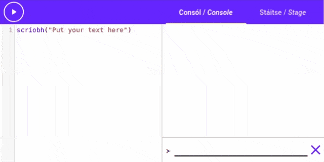

# Programming is...

Before we start [[learning|ag foghlaim]] how to write and use *Setanta*, we should ask:

> [[What is programming|Cad é ríomhchlarú]]?

[[Computers|Ríomhairí]] today are very [[smart|cliste]], they can do calculations no human could ever do in their head, and in the blink of an eye. However, computers need a lot of [[help|cabhair]], and programming is how we help them.

When we write programs, we write down [[instructions|treoracha]] for the computer to follow. The computer will read our instructions and follow them exactly.

### What's a programming language?

A [[programming language|teanga ríomhchlárúcháin]] is a language that the computer can understand, and we use it to write our instructions.

Modern programming languages are also designed so that people can understand them too. *Setanta* is one of those languages, but it's a little bit different.

Almost every programming language is designed to be close to English, but *Setanta* is different. When we write *Setanta* code, it's almost like we are writing the instructions in [[Irish|Gaeilge]].

### Syntax

Syntax is a fancy name for the set of rules that define a programming language. Spoken languages like Irish and [[English|Béarla]] also have a syntax, for example in English and Irish, every question must end with a question mark.

Programming languages have similar rules that define how you have to write things in the language.

# Simple instructions

To introduce programming and *Setanta*, let's look at some simple instructions.

## Scríobh

"[[Scríobh|Write]]" is the Irish word for "write". *Setanta* has an [[action|gníomh]] called `scríobh`{.setanta} that we can use to write [[text|téacs]] onto the console. We use the `scríobh`{.setanta} action like this:

```setanta
scríobh("Your text in here")
```

You can put any [[text|téacs]] you like in between the double quotes (") and `scríobh`{.setanta} will write it out on the console. Try it out here!

{{{
scríobh("Put your text here")
}}}

Change the text "Put your text here" to something else and run the code. See if you can make it print your name! Here's a quick GIF of something you could change it to.



## Calculations

We've seen that *Setanta* can write text, but we can do much more than that. [[For example|Mar shampla]], *Setanta* can do [[calculations|áirimh]] for you! Run this code and see how *Setanta* does all the [[maths|matamaitic]] for you.

{{{
scríobh("Answer:", 28 + 36 * 2)
}}}

You can change the [[values|luachanna]] of the [[numbers|uimhreacha]] or add in more. Try replacing "`28 + 36 * 2`{.setanta}" with a different maths expression. You can use all the [[symbols|siombailí]] that you already know, for example:

> "`+`" for addition, "`-`" for subtraction, "`*`" for multiplication and "`/`" for division.

You can also use [[brackets|lúibíní]] to build up [[complicated|casta]] expressions, Try printing these with `scríobh`{.setanta} in the editor above:

```setanta
1 + 2 * (3 - 4) / 5
1 + 2 - (3 + (4 - 5))
```

You can also use numbers with decimal points, such as `1.2`{.setanta} or `123.4`{.setanta}


# Combining Instructions

When the computer is following the instructions in our *Setanta* program. It starts at the top and works its way down the list. This means if we want to do one instruction after the other, all we have to do is put it on the next line. Check out this code:

{{{
scríobh("Before sleeping")
codladh(2000)
scríobh("After sleeping")
}}}

If you run this code, it will first print "Before sleeping", then it will pause for 2 seconds and print "After sleeping". This is because we used the [[`codladh`{.setanta}|sleep]] action.  "Codladh" translates into English as "sleep". We use `codladh`{.setanta} when we want the computer to wait for a while before moving on to the next instruction.

The `codladh`{.setanta} action takes a number of milliseconds (in this case 2000), and when the computer reaches the `codladh`{.setanta} instruction, it will wait for that many milliseconds before proceeding.

The steps the computer takes are:

1. Read the first line "`scríobh("Before sleeping")`{.setanta}" and write "Before sleeping" on the console as instructed.
2. Read the second line "`codladh(2000)`{.setanta}" and sleep for 2000 milliseconds (2 seconds).
3. Read the third line "`scríobh("After sleeping")`{.setanta}" and write "After sleeping" on the console.
4. Finished.

# Variables

One of the most [[important|tábhachtach]] abilities that a computer has is [[memory|cuimhne]]. When we write a program, we can ask the computer to remember certain values, and we can ask it to recall them later. To do this we use something called a [[variable|athróg]].

A variable is like a container that we can put a value inside. We can name the container and use the name when we want to refer to the container.

To make a new variable we use the "`:=`{.setanta}" symbol. For example

```{.setanta .numberLines}
bia := "sceallóga"
```

This code makes a new variable called [[`bia`|food]], and stores the value [[`"sceallóga"`{.setanta}|chips]] in that variable. Now if we called `scríobh(bia)`{.setanta} it would remember that we asked it to store "sceallóga" in the variable `bia`, and it would write "sceallóga" on the console.

Try it out now!

{{{
bia := "sceallóga"
scríobh(bia)
}}}

## Challenge

Change this code so that it writes [[`"ispíní"`|sausages]] on the console:

{{{
bia := "sceallóga"
scríobh(bia)
}}}

[[Click here for the answer|Change the first line to bia := &quot;ispíní&quot;]]

# What's next?

Now that we've seen some simple instructions for using the console, we've explored how to sequence instructions and learned how to store values in memory, we can use these new abilities on the stage!
